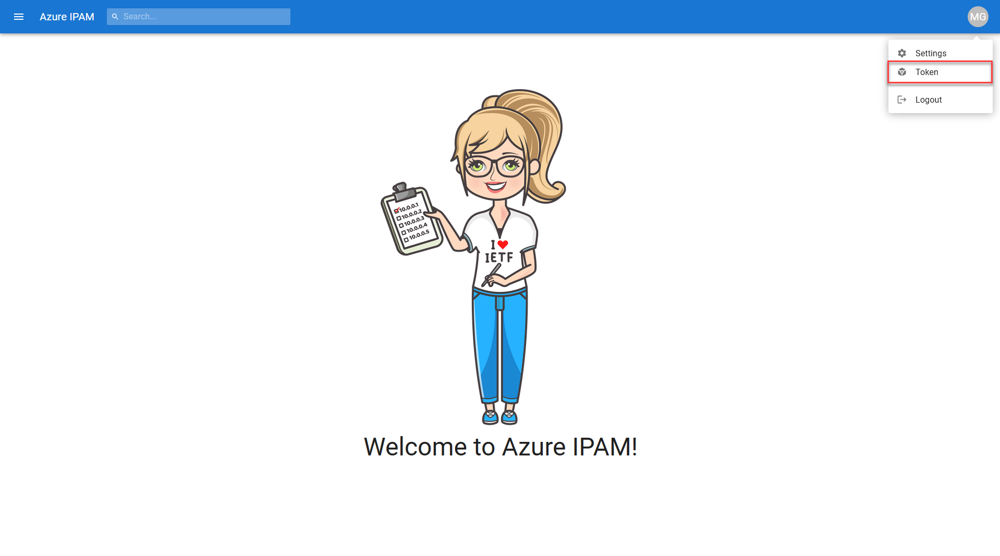
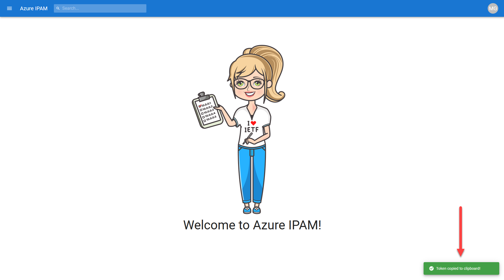
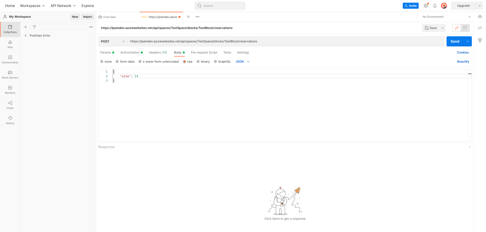
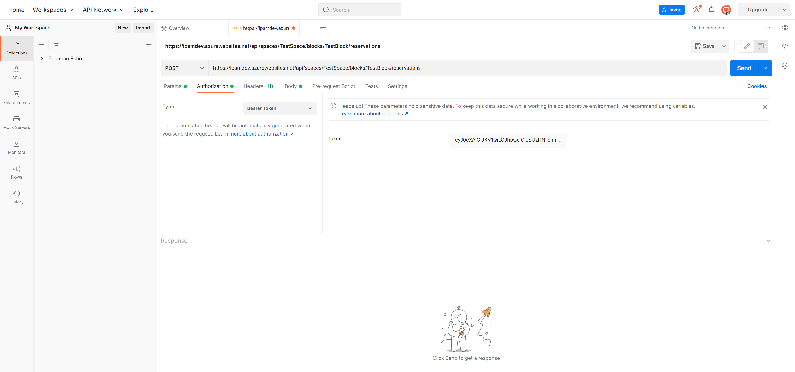
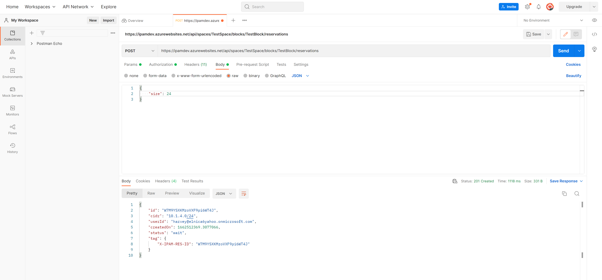

# Azure IPAM REST API Overview

You can interface with the full set of capabilities of Azure IPAM via a REST API. We use Swagger to define API documentation in OpenAPI v3 Specification format.

API docs can be found at the `/api/docs` path of your Azure IPAM website. Here you will find information on methods, parameters, and request body details for all available APIs.


## How to Call the API

You can interface with the API like you would any other REST API. We'll be using [Postman](https://www.postman.com) and [Azure PowerShell](https://docs.microsoft.com/powershell/azure/what-is-azure-powershell) for our examples.

## Obtaining an Azure AD Token

First things first, you'll need to obtain an Azure AD token for authentication purposes. You can retrieve one via the Azure IPAM UI at anytime by selecting **Token** from the menu presented when clicking on your user avatar in the upper righthand corner.



You'll then be presented with a message notifying you that your token has been saved to your clipboard.



You can also retrieve an Azure AD token from Azure IPAM via Azure PowerShell by using the [Get-AzAccessToken](https://docs.microsoft.com/powershell/module/az.accounts/get-azaccesstoken) commandlet. The token is retrieved from the API exposed via the backend engine application registration. This is the **ResourceUrl** you will be making the access token call against via Azure PowerShell.


```ps1
$accessToken = ConvertTo-SecureString (Get-AzAccessToken -ResourceUrl api://e3ff2k34-2271-58b5-9g2g-5004145608b3).Token -AsPlainText
```

## Sample API Calls

You'll need to provide the following for each API call:

* Bearer Token
* HTTP Method
* API Request URL
* HTTP Headers
* Request Body (PUT/PATCH/POST)

Here is an example of how to create an IP address CIDR reservation in order to create a new vNET. We'll be performing a POST to the following request URL:

```text
https://ipmadev.azurewebsites.net/api/spaces/TestSpace/blocks/TestBlock/reservations
```

The body contains a bit mask size of **/24**. Based on this, IPAM will provide the next available **/24** CIDR block available in the **TestBlock** found within our **TestSpace** (as denoted in our request URL).



Be sure to provide the appropriate headers under the **Headers** tab.


Lastly, don't forget to provide your token information under the **Authorization** tab.



Click **Send** and you will receive a response of type **201 Created** with key information regarding your CIDR block reservation request. Make note of the tag that is returned in the response. Tagging your newly created vNET with this key:value will automatically associate it with the **Block** the reservation was created from.



Here is the same example performed via Azure PowerShell.

```ps1
$engineClientId = '<Engine App Registration Client ID>'
$appName = 'ipamdev'
$space = 'TestSpace'
$block = 'TestBlock'

$accessToken = ConvertTo-SecureString (Get-AzAccessToken -ResourceUrl api://$engineClientId).Token -AsPlainText

$requestUrl = "https://$appName.azurewebsites.net/api/spaces/$space/blocks/$block/reservations"

$body = @{
    'size' = 24
} | ConvertTo-Json

$headers = @{
  'Accept' = 'application/json'
  'Content-Type' = 'application/json'
}

$response = Invoke-RestMethod `
 -Method 'Post' `
 -Uri $requestUrl `
 -Authentication 'Bearer' `
 -Token $accessToken `
 -Headers $headers `
 -Body $body
```

The call will return key information regarding your CIDR block reservation. Again, make note of the *tag* information in the response.

```ps1
$response

id        : ABNsJjXXyTRDTRCdJEJThu
cidr      : 10.1.5.0/24
userId    : user@ipam.onmicrosoft.com
createdOn : 1662514052.26623
status    : wait
tag       : @{X-IPAM-RES-ID=ABNsJjXXyTRDTRCdJEJThu}
```

Take a look at our **Azure Landing Zone integration** example found under the `deploy` directory in the repository for a real work example of how to automate vNET creation by means of Bicep and leveraging the Azure IPAM API.
