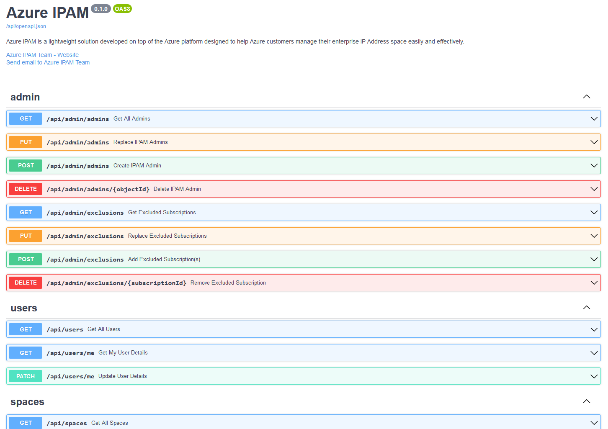
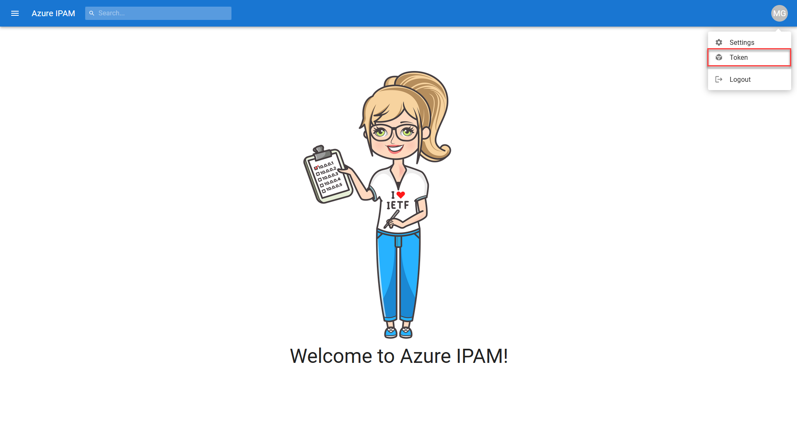
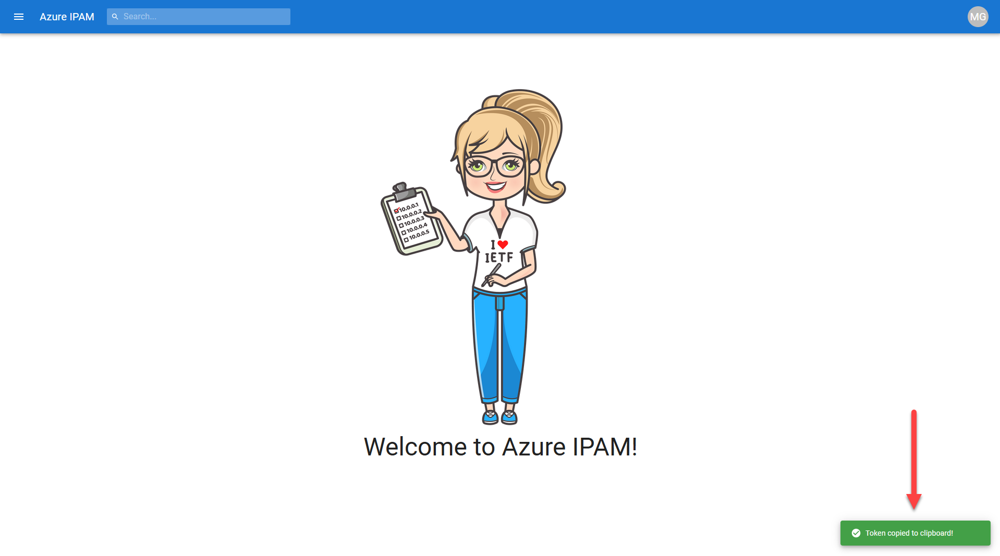
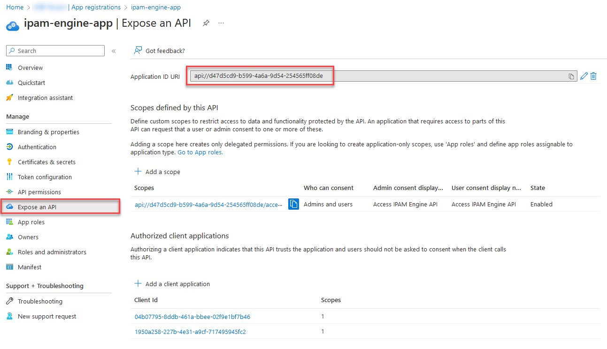
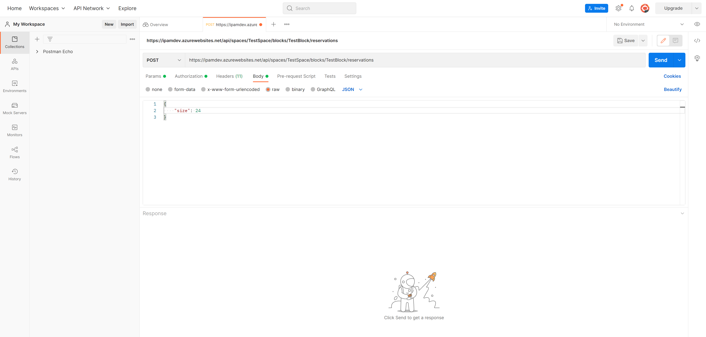
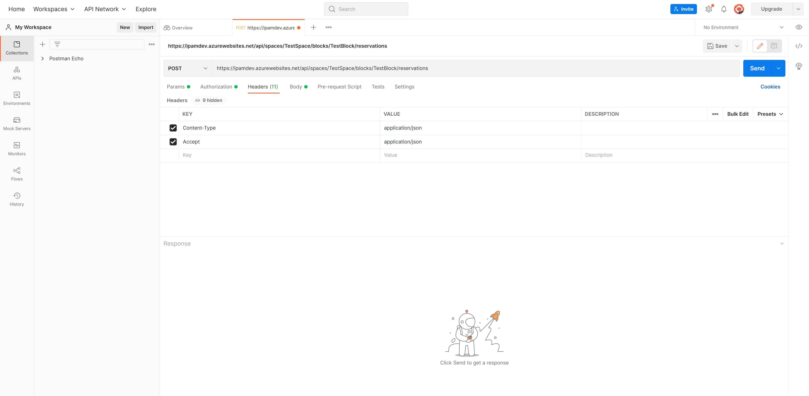
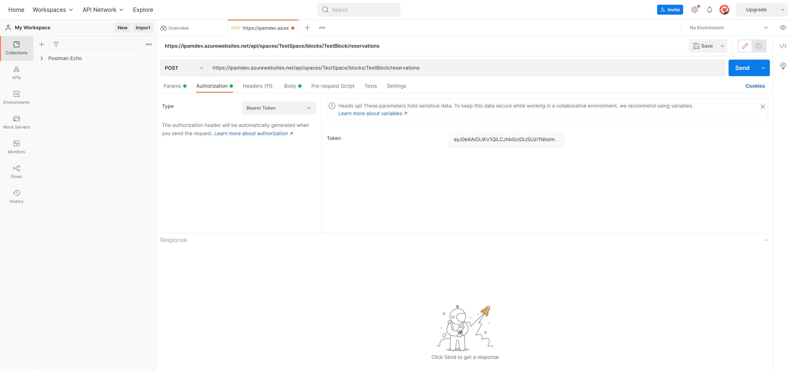
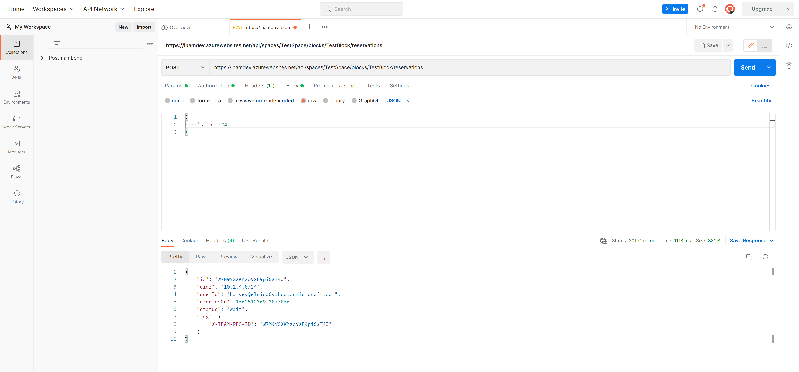

# Azure IPAM REST API Overview

You can interface with the full set of capabilities of Azure IPAM via a REST API. We use Swagger to define API documentation in OpenAPI v3 Specification format.

API docs can be found at the `/api/docs` path of your Azure IPAM website. Here you will find information on methods, parameters, and request body details for all available APIs.



## How to Call the API

You can interface with the API like you would any other REST API. We'll be using [Postman](https://www.postman.com) and [Azure PowerShell](https://docs.microsoft.com/powershell/azure/what-is-azure-powershell) for our examples.

## Obtaining an Azure AD Token

First things first, you'll need to obtain an Azure AD token for authentication purposes. You can retrieve one via the Azure IPAM UI at anytime by selecting **Token** from the menu presented when clicking on your user avatar in the upper righthand corner.



You'll then be presented with a message notifying you that your token has been saved to your clipboard.



You can also retrieve an Azure AD token from Azure IPAM via Azure PowerShell by using the [Get-AzAccessToken](https://docs.microsoft.com/powershell/module/az.accounts/get-azaccesstoken) commandlet. The token is retrieved from the API exposed via the backend engine application registration. This is the **ResourceUrl** you will be making the access token call against via Azure PowerShell.



```powershell
$accessToken = ConvertTo-SecureString (Get-AzAccessToken -ResourceUrl api://e3ff2k34-2271-58b5-9g2g-5004145608b3).Token -AsPlainText
```

## CIDR Reservations

CIDR Reservations allow you to claim address space within a Block before creating an Azure virtual network. For more information on what reservations are, how the lifecycle works, and how to manage them via the UI, please see the [Reservations](/how-to/README.md#reservations) section of the How-To documentation.

The API supports creating reservations against a specific Block, or against a list of Blocks (IPAM will use the first Block with available space).

### Reservation Endpoints

| Method | Path | Description |
|--------|------|-------------|
| `GET` | `/spaces/{space}/reservations` | List reservations across all Blocks in a Space |
| `POST` | `/spaces/{space}/reservations` | Create a reservation from a list of Blocks |
| `GET` | `/spaces/{space}/blocks/{block}/reservations` | List reservations for a specific Block |
| `POST` | `/spaces/{space}/blocks/{block}/reservations` | Create a reservation in a specific Block |
| `GET` | `/spaces/{space}/blocks/{block}/reservations/{reservation}` | Get a specific reservation |
| `DELETE` | `/spaces/{space}/blocks/{block}/reservations` | Delete (cancel) multiple reservations |
| `DELETE` | `/spaces/{space}/blocks/{block}/reservations/{reservation}` | Delete (cancel) a single reservation |

> **Note:** The `GET` endpoints accept a `settled` query parameter (default: `false`). Set it to `true` to include fulfilled and cancelled reservations in the results. Non-admin users will only see reservations they created.

### Example API Calls

You'll need to provide the following for each API call:

* Bearer Token
* HTTP Method
* API Request URL
* HTTP Headers
* Request Body (POST/DELETE)

Here is an example of how to create an IP address CIDR reservation in order to create a new vNET. We'll be performing a POST to the following request URL:

```text
https://ipamdev.azurewebsites.net/api/spaces/TestSpace/blocks/TestBlock/reservations
```

The body contains a bit mask size of **/24**. Based on this, IPAM will provide the next available **/24** CIDR block available in the **TestBlock** found within our **TestSpace** (as denoted in our request URL).



Be sure to provide the appropriate headers under the **Headers** tab.



Lastly, don't forget to provide your token information under the **Authorization** tab.



Click **Send** and you will receive a response of type **201 Created** with key information regarding your CIDR block reservation request. Make note of the tag that is returned in the response. Tagging your newly created vNET with this key:value will automatically associate it with the **Block** the reservation was created from.



Here is the same example performed via Azure PowerShell. First, set up the common variables and authentication:

```powershell
$engineClientId = '<Engine App Registration Client ID>'
$appName = 'ipamdev'
$space = 'TestSpace'
$block = 'TestBlock'

$accessToken = ConvertTo-SecureString (Get-AzAccessToken -ResourceUrl api://$engineClientId).Token -AsPlainText

$headers = @{
    'Accept'       = 'application/json'
    'Content-Type' = 'application/json'
}
```

#### Create a Reservation by Size

The simplest way to create a reservation is by specifying a mask size. IPAM will find the next available CIDR of that size within the Block.

```powershell
$body = @{
    size = 24
    desc = 'Reservation for Project Alpha vNET'
} | ConvertTo-Json

$response = Invoke-RestMethod `
    -Method 'Post' `
    -Uri "https://$appName.azurewebsites.net/api/spaces/$space/blocks/$block/reservations" `
    -Authentication 'Bearer' `
    -Token $accessToken `
    -Headers $headers `
    -Body $body
```

The call will return key information regarding your CIDR block reservation. Make note of the *tag* information in the response — you'll need to apply it to your virtual network.

```text
$response

id        : ABNsJjXXyTRDTRCdJEJThu
cidr      : 10.1.5.0/24
desc      : Reservation for Project Alpha vNET
createdOn : 1662514052.26623
status    : wait
tag       : @{X-IPAM-RES-ID=ABNsJjXXyTRDTRCdJEJThu}
```

You can also control how IPAM selects the available range:

```powershell
# Allocate from the end of the Block and use the smallest fitting range
$body = @{
    size           = 24
    desc           = 'Reservation at end of block'
    reverse_search = $true
    smallest_cidr  = $true
} | ConvertTo-Json

$response = Invoke-RestMethod `
    -Method 'Post' `
    -Uri "https://$appName.azurewebsites.net/api/spaces/$space/blocks/$block/reservations" `
    -Authentication 'Bearer' `
    -Token $accessToken `
    -Headers $headers `
    -Body $body
```

#### Create a Reservation by CIDR

If you need a specific CIDR range, provide it directly instead of a size. The CIDR must be within the Block and cannot overlap existing allocations.

```powershell
$body = @{
    cidr = '10.1.10.0/24'
    desc = 'Specific range for DMZ network'
} | ConvertTo-Json

$response = Invoke-RestMethod `
    -Method 'Post' `
    -Uri "https://$appName.azurewebsites.net/api/spaces/$space/blocks/$block/reservations" `
    -Authentication 'Bearer' `
    -Token $accessToken `
    -Headers $headers `
    -Body $body
```

> **Note:** The `cidr` and `size` parameters cannot be used together. The `reverse_search` and `smallest_cidr` options are only available when using `size`.

#### Create a Reservation from Multiple Blocks

If you're flexible about which Block the reservation comes from, you can provide a list of Block names. IPAM will evaluate them in order and create the reservation in the first Block with available space.

```powershell
$body = @{
    blocks = @('PrimaryBlock', 'SecondaryBlock', 'OverflowBlock')
    size   = 24
    desc   = 'Flexible reservation across blocks'
} | ConvertTo-Json

$response = Invoke-RestMethod `
    -Method 'Post' `
    -Uri "https://$appName.azurewebsites.net/api/spaces/$space/reservations" `
    -Authentication 'Bearer' `
    -Token $accessToken `
    -Headers $headers `
    -Body $body
```

Note the different request URL — this uses the Space-level endpoint (`/spaces/{space}/reservations`) rather than the Block-level endpoint.

#### List Reservations

You can retrieve all active reservations for a Block, or across all Blocks in a Space.

```powershell
# Get active reservations for a specific Block
$reservations = Invoke-RestMethod `
    -Method 'Get' `
    -Uri "https://$appName.azurewebsites.net/api/spaces/$space/blocks/$block/reservations" `
    -Authentication 'Bearer' `
    -Token $accessToken `
    -Headers $headers

# Include settled (fulfilled/cancelled) reservations
$allReservations = Invoke-RestMethod `
    -Method 'Get' `
    -Uri "https://$appName.azurewebsites.net/api/spaces/$space/blocks/$block/reservations?settled=true" `
    -Authentication 'Bearer' `
    -Token $accessToken `
    -Headers $headers

# Get reservations across all Blocks in a Space
$spaceReservations = Invoke-RestMethod `
    -Method 'Get' `
    -Uri "https://$appName.azurewebsites.net/api/spaces/$space/reservations" `
    -Authentication 'Bearer' `
    -Token $accessToken `
    -Headers $headers
```

#### Cancel a Reservation

Cancelling a reservation releases the held CIDR range so it can be used for other allocations. You can cancel a single reservation or multiple at once.

```powershell
# Cancel a single reservation by ID
Invoke-RestMethod `
    -Method 'Delete' `
    -Uri "https://$appName.azurewebsites.net/api/spaces/$space/blocks/$block/reservations/ABNsJjXXyTRDTRCdJEJThu" `
    -Authentication 'Bearer' `
    -Token $accessToken `
    -Headers $headers

# Cancel multiple reservations at once
$body = @(
    'ABNsJjXXyTRDTRCdJEJThu',
    'CDPtKkYYzUSEUSdKFKUViv'
) | ConvertTo-Json

Invoke-RestMethod `
    -Method 'Delete' `
    -Uri "https://$appName.azurewebsites.net/api/spaces/$space/blocks/$block/reservations" `
    -Authentication 'Bearer' `
    -Token $accessToken `
    -Headers $headers `
    -Body $body
```

> **Note:** Cancelling a reservation does not hard-delete it. The reservation remains in the system with a status of `cancelledByUser` and is visible when querying with `settled=true`. Non-admin users can only cancel reservations they created.

Take a look at our **Azure Landing Zone integration** example found under the `deploy` directory in the repository for a real work example of how to automate vNET creation by means of Bicep and leveraging the Azure IPAM API.

## External Networks

External Networks allow you to track IP address space that lives outside of Azure (such as on-premises datacenters, co-location facilities, or other cloud providers) directly within Azure IPAM. All External Network operations follow the existing Space/Block hierarchy and are restricted to IPAM administrators.

For more information on what External Networks are, how they fit into the IPAM hierarchy, and how to manage them via the UI, please see the [External Networks](/how-to/README.md#external-networks) section of the How-To documentation.

The API base path for External Networks is:

```text
/api/spaces/{space}/blocks/{block}/externals
```

### External Network Endpoints

| Method | Path | Description |
|--------|------|-------------|
| `GET` | `/spaces/{space}/blocks/{block}/externals` | List all External Networks in a Block |
| `POST` | `/spaces/{space}/blocks/{block}/externals` | Create a new External Network |
| `GET` | `/spaces/{space}/blocks/{block}/externals/{external}` | Get details of a specific External Network |
| `PATCH` | `/spaces/{space}/blocks/{block}/externals/{external}` | Update an External Network (JSON Patch) |
| `DELETE` | `/spaces/{space}/blocks/{block}/externals/{external}` | Delete an External Network |

### External Subnet Endpoints

| Method | Path | Description |
|--------|------|-------------|
| `GET` | `/spaces/{space}/blocks/{block}/externals/{external}/subnets` | List all Subnets in an External Network |
| `POST` | `/spaces/{space}/blocks/{block}/externals/{external}/subnets` | Create a new Subnet |
| `GET` | `/spaces/{space}/blocks/{block}/externals/{external}/subnets/{subnet}` | Get details of a specific Subnet |
| `PATCH` | `/spaces/{space}/blocks/{block}/externals/{external}/subnets/{subnet}` | Update a Subnet (JSON Patch) |
| `DELETE` | `/spaces/{space}/blocks/{block}/externals/{external}/subnets/{subnet}` | Delete a Subnet |

### External Endpoint Endpoints

| Method | Path | Description |
|--------|------|-------------|
| `GET` | `/spaces/{space}/blocks/{block}/externals/{external}/subnets/{subnet}/endpoints` | List all Endpoints in a Subnet |
| `POST` | `/spaces/{space}/blocks/{block}/externals/{external}/subnets/{subnet}/endpoints` | Create a new Endpoint |
| `PUT` | `/spaces/{space}/blocks/{block}/externals/{external}/subnets/{subnet}/endpoints` | Replace all Endpoints in a Subnet |
| `DELETE` | `/spaces/{space}/blocks/{block}/externals/{external}/subnets/{subnet}/endpoints` | Delete one or more Endpoints |
| `GET` | `/spaces/{space}/blocks/{block}/externals/{external}/subnets/{subnet}/endpoints/{endpoint}` | Get a specific Endpoint |
| `PATCH` | `/spaces/{space}/blocks/{block}/externals/{external}/subnets/{subnet}/endpoints/{endpoint}` | Update an Endpoint (JSON Patch) |
| `DELETE` | `/spaces/{space}/blocks/{block}/externals/{external}/subnets/{subnet}/endpoints/{endpoint}` | Delete a specific Endpoint |

### Example API Calls

The following examples demonstrate common External Network operations using Azure PowerShell. As with the CIDR Reservation examples above, you'll need to obtain an Azure AD token and set up your common variables first.

```powershell
$engineClientId = '<Engine App Registration Client ID>'
$appName = 'ipamdev'
$space = 'MySpace'
$block = 'MyBlock'

$accessToken = ConvertTo-SecureString (Get-AzAccessToken -ResourceUrl api://$engineClientId).Token -AsPlainText

$headers = @{
    'Accept'       = 'application/json'
    'Content-Type' = 'application/json'
}
```

#### Create an External Network

Here we'll create an External Network with a specific CIDR range. We'll be performing a POST to the following request URL:

```text
https://ipamdev.azurewebsites.net/api/spaces/MySpace/blocks/MyBlock/externals
```

```powershell
$body = @{
    name = 'OnPrem-DC1'
    desc = 'On-premises datacenter 1 network'
    cidr = '10.0.100.0/24'
} | ConvertTo-Json

$response = Invoke-RestMethod `
    -Method 'Post' `
    -Uri "https://$appName.azurewebsites.net/api/spaces/$space/blocks/$block/externals" `
    -Authentication 'Bearer' `
    -Token $accessToken `
    -Headers $headers `
    -Body $body
```

If you don't have a specific CIDR in mind, you can request a network by size and IPAM will allocate the next available range within the Block:

```powershell
$body = @{
    name = 'OnPrem-DC2'
    desc = 'On-premises datacenter 2 network'
    size = 24
} | ConvertTo-Json

$response = Invoke-RestMethod `
    -Method 'Post' `
    -Uri "https://$appName.azurewebsites.net/api/spaces/$space/blocks/$block/externals" `
    -Authentication 'Bearer' `
    -Token $accessToken `
    -Headers $headers `
    -Body $body
```

#### Create an External Subnet

Once you have an External Network, you can add Subnets to it. The CIDR for the Subnet must fall within the parent External Network's CIDR range.

```powershell
$external = 'OnPrem-DC1'

$body = @{
    name = 'ServerSubnet'
    desc = 'Server VLAN in DC1'
    cidr = '10.0.100.0/26'
} | ConvertTo-Json

$response = Invoke-RestMethod `
    -Method 'Post' `
    -Uri "https://$appName.azurewebsites.net/api/spaces/$space/blocks/$block/externals/$external/subnets" `
    -Authentication 'Bearer' `
    -Token $accessToken `
    -Headers $headers `
    -Body $body
```

#### Create an External Endpoint

With a Subnet in place, you can add individual Endpoints. You can provide a specific IP address, or pass `$null` to have IPAM automatically assign the next available IP within the Subnet.

```powershell
$subnet = 'ServerSubnet'

# Create an endpoint with a specific IP
$body = @{
    name = 'db-server-01'
    desc = 'Primary database server'
    ip   = '10.0.100.5'
} | ConvertTo-Json

$response = Invoke-RestMethod `
    -Method 'Post' `
    -Uri "https://$appName.azurewebsites.net/api/spaces/$space/blocks/$block/externals/$external/subnets/$subnet/endpoints" `
    -Authentication 'Bearer' `
    -Token $accessToken `
    -Headers $headers `
    -Body $body

# Create an endpoint with an auto-assigned IP
$body = @{
    name = 'app-server-01'
    desc = 'Application server'
    ip   = $null
} | ConvertTo-Json

$response = Invoke-RestMethod `
    -Method 'Post' `
    -Uri "https://$appName.azurewebsites.net/api/spaces/$space/blocks/$block/externals/$external/subnets/$subnet/endpoints" `
    -Authentication 'Bearer' `
    -Token $accessToken `
    -Headers $headers `
    -Body $body
```

#### Update an External Network

You can update External Network properties using a JSON Patch. The same approach works for updating External Subnets and Endpoints by adjusting the request URL accordingly.

```powershell
$external = 'OnPrem-DC1'

$body = @(
    @{
        op    = 'replace'
        path  = '/desc'
        value = 'Updated description for DC1'
    }
) | ConvertTo-Json

$response = Invoke-RestMethod `
    -Method 'Patch' `
    -Uri "https://$appName.azurewebsites.net/api/spaces/$space/blocks/$block/externals/$external" `
    -Authentication 'Bearer' `
    -Token $accessToken `
    -Headers $headers `
    -Body $body
```

#### Bulk Replace Endpoints

You can replace the entire endpoint list for a Subnet in a single operation using the `PUT` method. This is particularly useful for automation scenarios where an external system produces a complete inventory.

```powershell
$body = @(
    @{
        name = 'db-server-01'
        desc = 'Primary database server'
        ip   = '10.0.100.5'
    },
    @{
        name = 'db-server-02'
        desc = 'Secondary database server'
        ip   = '10.0.100.6'
    },
    @{
        name = 'app-server-01'
        desc = 'Application server'
        ip   = $null
    }
) | ConvertTo-Json

$response = Invoke-RestMethod `
    -Method 'Put' `
    -Uri "https://$appName.azurewebsites.net/api/spaces/$space/blocks/$block/externals/$external/subnets/$subnet/endpoints" `
    -Authentication 'Bearer' `
    -Token $accessToken `
    -Headers $headers `
    -Body $body
```

#### Delete Endpoints

You can remove one or more Endpoints from a Subnet by passing an array of endpoint names.

```powershell
$body = @(
    'db-server-01',
    'app-server-01'
) | ConvertTo-Json

$response = Invoke-RestMethod `
    -Method 'Delete' `
    -Uri "https://$appName.azurewebsites.net/api/spaces/$space/blocks/$block/externals/$external/subnets/$subnet/endpoints" `
    -Authentication 'Bearer' `
    -Token $accessToken `
    -Headers $headers `
    -Body $body
```

#### Delete an External Network

Deleting an External Network will fail if it contains Subnets unless you pass the `force` query parameter.

```powershell
# Delete (will fail if subnets exist)
Invoke-RestMethod `
    -Method 'Delete' `
    -Uri "https://$appName.azurewebsites.net/api/spaces/$space/blocks/$block/externals/$external" `
    -Authentication 'Bearer' `
    -Token $accessToken `
    -Headers $headers

# Force delete (removes the network even if subnets exist)
Invoke-RestMethod `
    -Method 'Delete' `
    -Uri "https://$appName.azurewebsites.net/api/spaces/$space/blocks/$block/externals/$external`?force=true" `
    -Authentication 'Bearer' `
    -Token $accessToken `
    -Headers $headers
```
