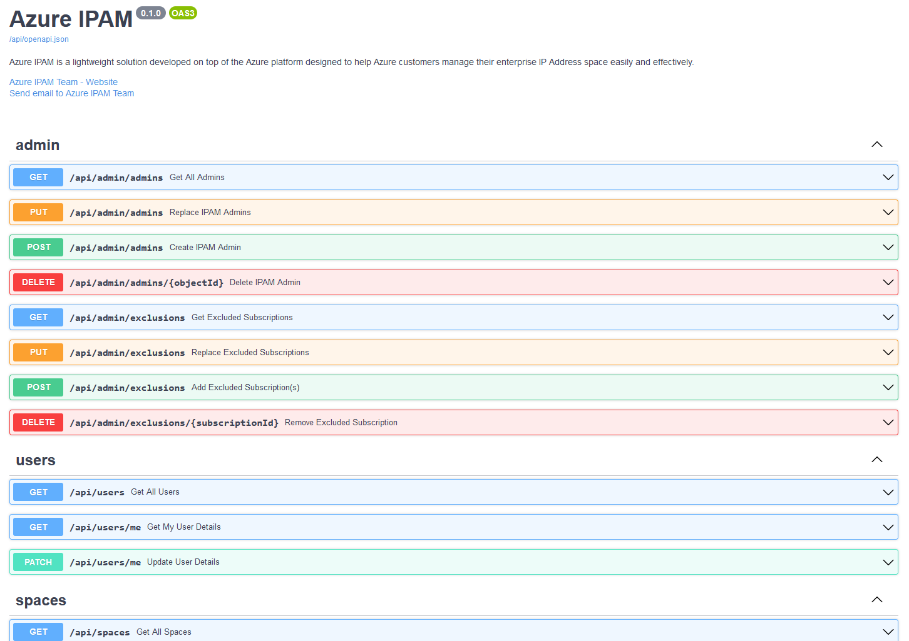

## IPAM REST API Overview
You can interface with the full set of capabilities of IPAM via a REST API. We use Swagger to define API documentation in OpenAPI v3 Specification format.

API docs can be found at the `/api/docs` path of your IPAM website

