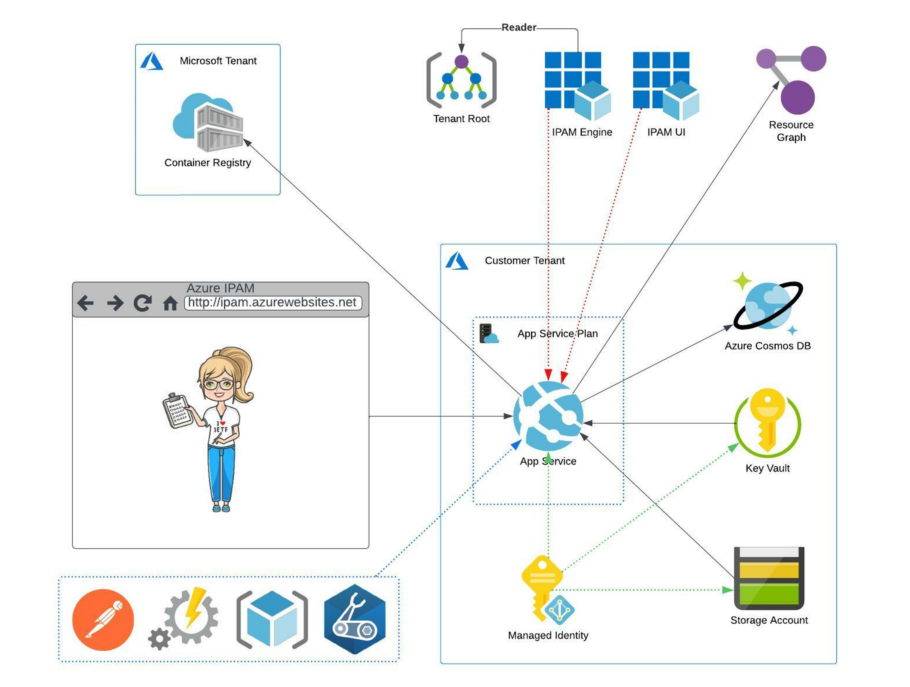

## IPAM Architecture Overview
IPAM is designed and architected based on the 5 pillars of the [Microsoft Azure Well Architected Framework](https://docs.microsoft.com/en-us/azure/architecture/framework/). 

### IPAM Infrastructure
There are two major components to the IPAM solution. The first is the two container images that make up the IPAM application. These containers are maintained and hosted by the IPAM team. They are housed in a publicly accessible Azure Container Registry. The deployment workflow knows where and how to retrieve the container images. That being said, the application code is available in this project, so you can build your own container images if you'd like. More on that in the [deployment section](../deployment.README.md). The second component of the solution is the infrastructure to run the application which is maintained and hosted by you. This component is made up of the following: 

- **App Registrations**
  - two App Registrations are deployed as part of the solution:
    - engine app registration, used to:
      - expose the backend engine portion of the application
      - perform Resource Graph calls for retrieving IP address utilization information. This App Registration is granted the "Reader" role at the Tenant Root level in order to perform said Resource Graph calls on the user's behalf. More on this in our How-To section
    - UI app registration, used to:
      - expose the single page front end application
      - handle authentication requests to Azure AD on behalf of the user
      - handle authorization request to the backend engine on behalf of the user
- **Resource Group** 
  - to house all Azure infrastructure related resources
- **App Service Plan with App Service**
  - to run the two containers that make up the IPAM application
- **Storage Account with Blob Container**
  - to store NGINX related configuration data
- **Cosmos DB**
  - used as the backend data store for the IPAM application
- **Key Vault**
  - to store the following secrets:
    - App Registration application IDs and passwords
    - Cosmos DB read-write key
    - Azure Tenant ID
- **User Assigned Managed Identity**
  - used by App Service to retrieve secrets from Key Vault and NGINX configuration data from the Storage Account

