# How to Use IPAM

## Authentication and Authorization

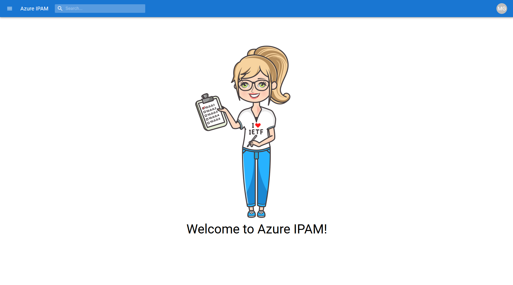

IPAM leverages the [Microsoft Authentication Library (MSAL)](https://docs.microsoft.com/azure/active-directory/develop/msal-overview) in order to authenticate users. It uses your existing Azure AD credentials to authenticate you and leverages your existing Azure RBAC permissions to authorize what information is visible from within the IPAM tool.

IPAM has the concept of an **IPAM Administrator**. While using the IPAM tool as an administrator, you are viewing Azure resources through the permissions of the Engine Service Principal which, by default, has [Reader](https://learn.microsoft.com/azure/role-based-access-control/built-in-roles#reader) at the [Tenant Root Management Group](https://learn.microsoft.com/azure/governance/management-groups/overview#root-management-group-for-each-directory) level (unless specified otherwise at deployment time). Upon initial deployment, no IPAM administrators are set which has the effect of **all** users having administrative rights. You can define who within your Azure AD Tenant should be designated as an IPAM administrator via the **Admin** section of the menu blade.

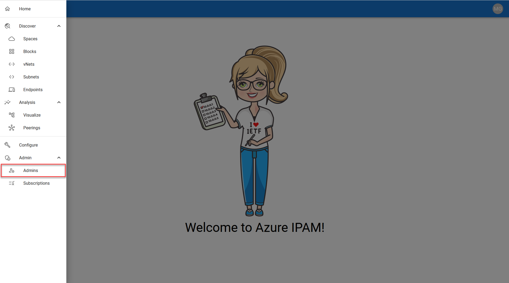

IPAM administrators have the ability to configure create/update [Spaces](#spaces) and [Blocks](#blocks) via the **Configure** section of the menu blade (more on that below). Once at least one IPAM administrator is set, non-admin users will only see resources in IPAM they already have access to from the Azure Portal, and the administrative functions of the IPAM tool will no longer be available to them.

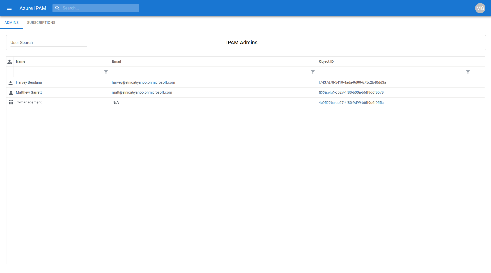

## Subscription Exclusion/Inclusion

As an IPAM administrator, you have the ability to include/exclude subscriptions from the IPAM view. To do so, expand the **Admin** section of the menu blade and select **Subscriptions**.

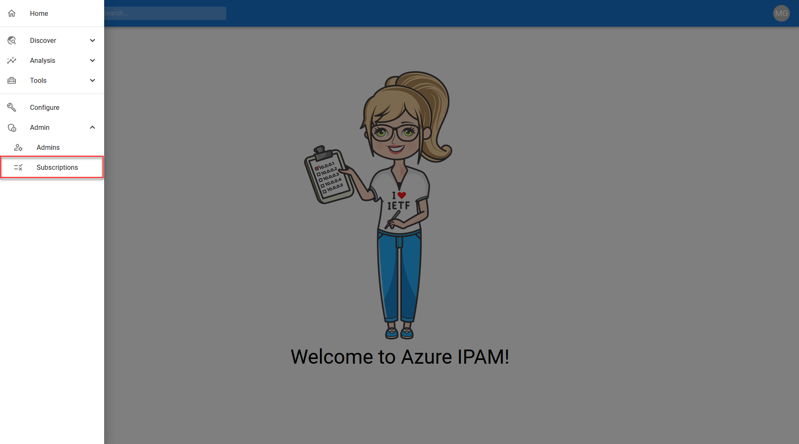

From this screen, you can select Subscriptions which are to be <u>**excluded**</u> from IPAM by clicking on them. Once selected for exclusion, the subscription will be highlighted in **red**. Don't forget to click **save** in the upper-right once complete.

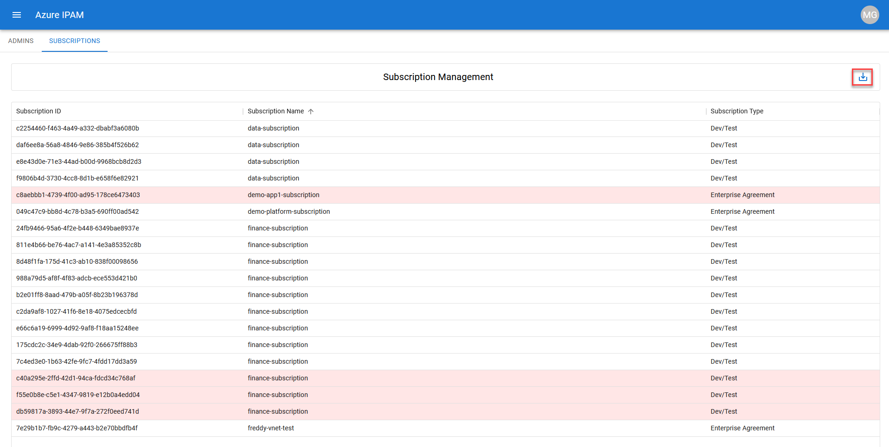

## Spaces

A **Space** represents a logical grouping of *unique* IP address space. **Spaces** can contain both contiguous and non-contiguous IP address CIDR blocks. A **Space** cannot contain any overlapping CIDR blocks. As an IPAM user, you can get to the **Spaces** tab via the **Discover** section of the menu blade. From the **Spaces** tab, you can see utilization metrics for each **Space**.

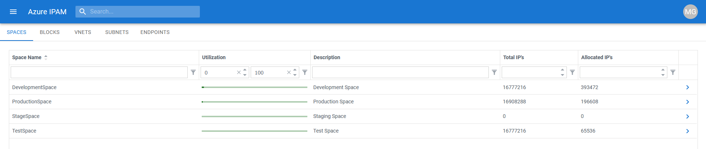

As an IPAM Administrator, you can add **Spaces** via the **Configure** section of the menu blade. Clicking on the 3 ellipses will bring up a menu of **Space** operations. Select **Add Space**.

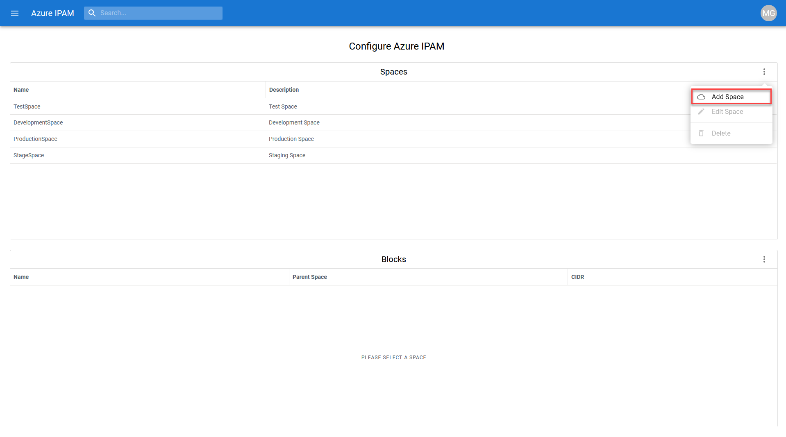

Give the new **Space** a name and a description, then click **Create** to create a new **Space**.

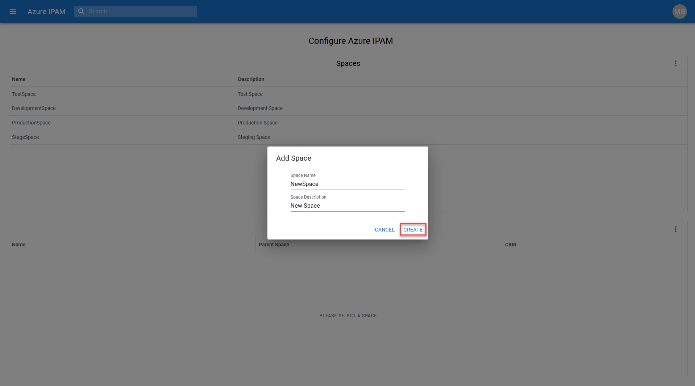

## Blocks

A **Block** represents an IP address CIDR range. It can contain vNETs whose address space resides within the defined CIDR range of the **Block**. **Blocks** cannot contain vNETs with overlapping address space. As an IPAM user, you can get to the **Blocks** tab via the **Discover** section of the menu blade. From the **Blocks** tab, you can see utilization metrics for each **Block**.

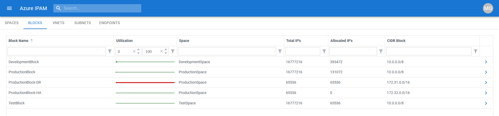

As an IPAM Administrator, you can add **Blocks** via the **Configure** section of the menu blade. After selecting which **Space** you want to add a **Block** to, clicking on the 3 ellipses will bring up a menu of **Block** operations. Select **Add Block**.

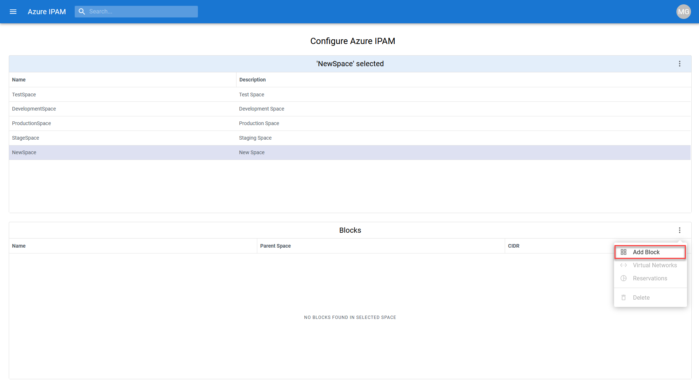

Give the new **Block** a name a valid CIDR range, then click **Create** to create add a new **Block** to the target **Space**.

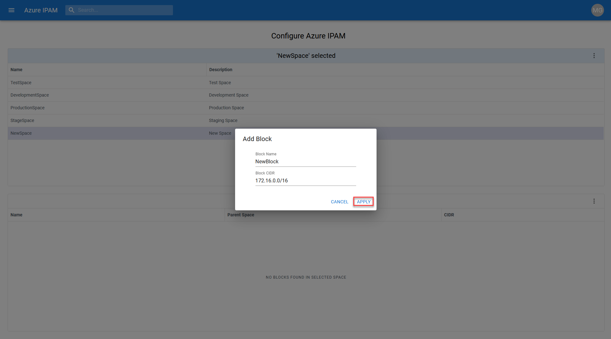

## Virtual Network Association

As an IPAM Administrator, you can associate Azure virtual networks to **Blocks**. To associate a virtual network to a **Block**, select the **Block** you want to associate the virtual network to, then click on the 3 ellipses to bring up a menu of **Block** operations. Select **Virtual Networks**.

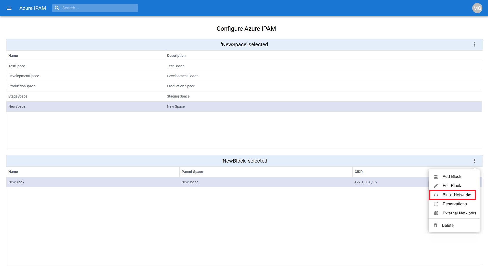

Place a checkmark next to the virtual networks you'd like to associate to the target **Block**, or un-check virtual networks you'd like to disassociate from the target **Block**, then click **Apply**.

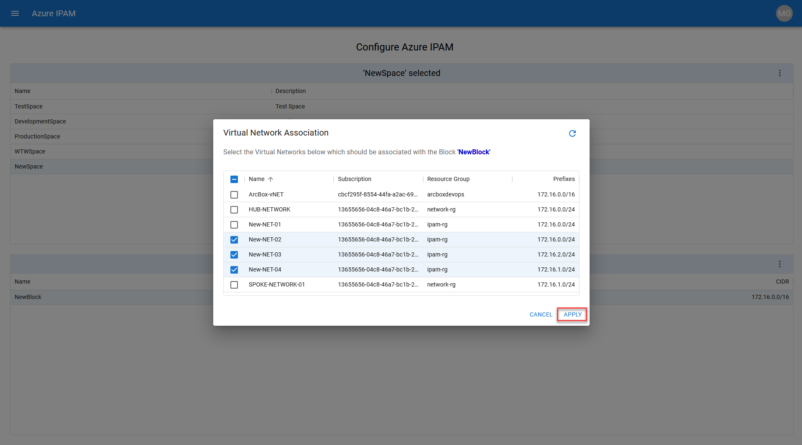

## Reservations

Currently, IP CIDR block reservations are not supported via the UI, but are supported programmatically via the API. Please see the **Example API Calls** section for more information on how to create IP address block reservations.

## vNETs, Subnets, and Endpoints

As an IPAM user, you can view IP address utilization information and detailed Azure resource related information for **vNETs**, **Subnets**, and **Endpoints** you have existing Azure RBAC access to.

### Virtual Networks

For **vNETs**, you can find the name, view the parent **Block** (if assigned), utilization metrics, and the **vNET** address space(s).

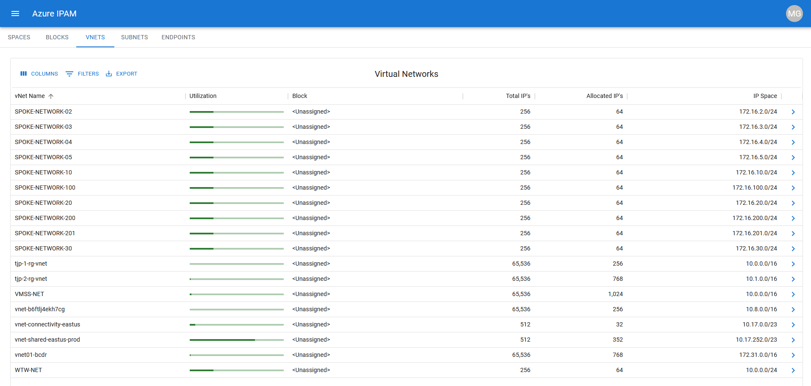

By clicking to expand the **vNET** details, you can find more granular **vNET** information and are presented the option to view the **vNET** resource directly in the Azure Portal by clicking on **VIEW IN PORTAL**.

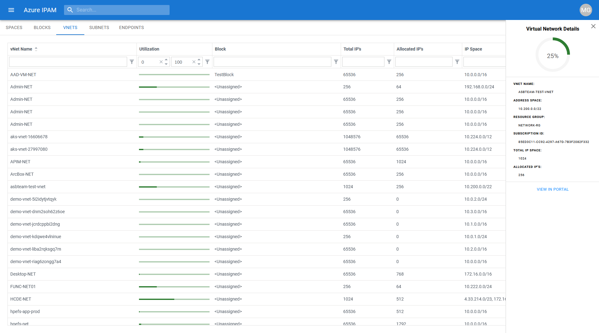

### Subnets

For **Subnets**, you can find the name, view the parent **vNET**, utilization metrics, and the **Subnet** address range.

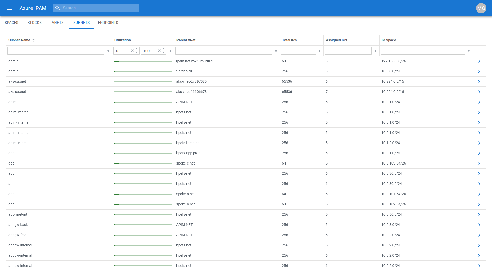

By clicking to expand the **Subnet** details, you can find more granular **Subnet** information and are presented the option to view the **Subnet** resource directly in the Azure Portal by clicking on **VIEW IN PORTAL**.

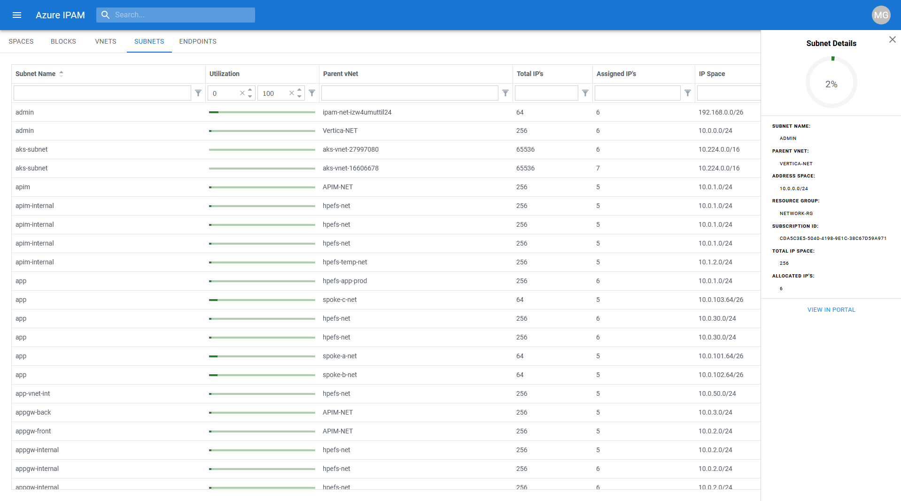

### Endpoints

For **Endpoints**, you can find the name, view the parent **vNET** and **Subnet**, Resource Group, and the private IP of the **Endpoint**

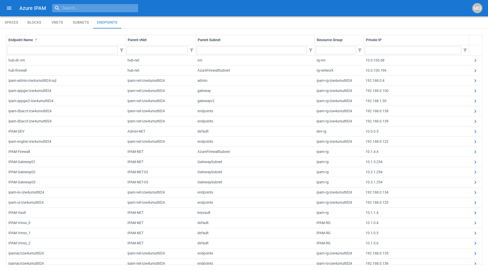

By clicking to expand the **Endpoint** details, you can find more granular **Endpoint** information (which varies based on the endpoint type) and are presented the option to view the **Endpoint** resource directly in the Azure Portal by clicking on **VIEW IN PORTAL**.

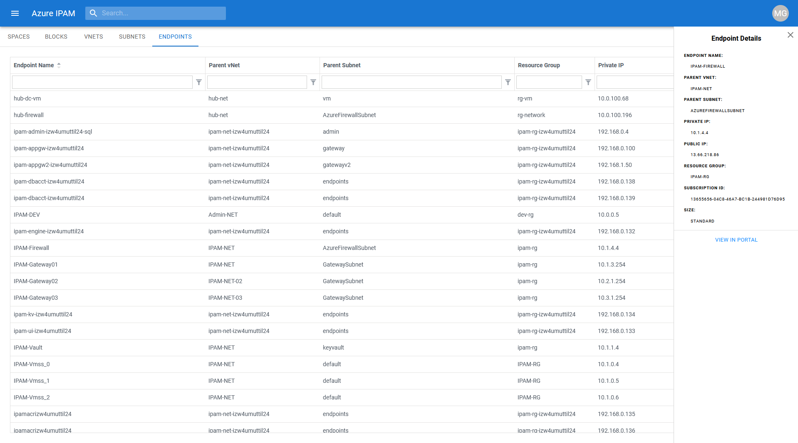
