# How to Use IPAM

## Authentication and Authorization

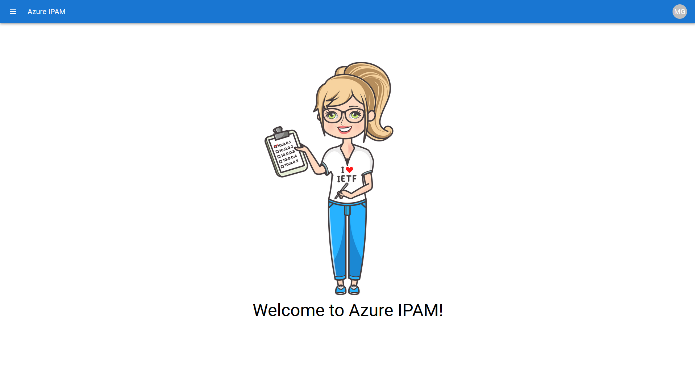

IPAM leverages the [Microsoft Authentication Library (MSAL)](https://docs.microsoft.com/azure/active-directory/develop/msal-overview) in order to authenticate users. It uses your existing Azure AD credentials to authenticate you and leverages your existing Azure RBAC permissions to authorize what information is visible from within the IPAM tool.

IPAM has the concept of an **IPAM Administrator**. While using the IPAM tool as an administrator, you are viewing Azure resources through the permissions of the Engine Service Principal which, by default, has [Reader](https://learn.microsoft.com/azure/role-based-access-control/built-in-roles#reader) at the [Tenant Root Management Group](https://learn.microsoft.com/azure/governance/management-groups/overview#root-management-group-for-each-directory) level (unless specified otherwise at deployment time). Upon initial deployment, no IPAM administrators are set which has the effect of **all** users having administrative rights. You can define who within your Azure AD Tenant should be designated as an IPAM administrator via the **Admin** section of the menu blade.


IPAM administrators have the ability to configure create/update [Spaces](#spaces) and [Blocks](#blocks) via the **Configure** section of the menu blade (more on that below). Once at least one IPAM administrator is set, non-admin users will only see resources in IPAM they already have access to from the Azure Portal, and the administrative functions of the IPAM tool will no longer be available to them.

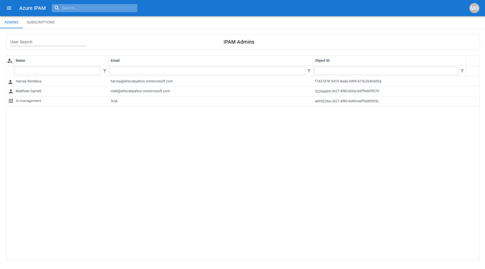

## Subscription Exclusion/Inclusion

As an IPAM administrator, you have the ability to include/exclude subscriptions from the IPAM view. To do so, expand the **Admin** section of the menu blade and select **Subscriptions**.

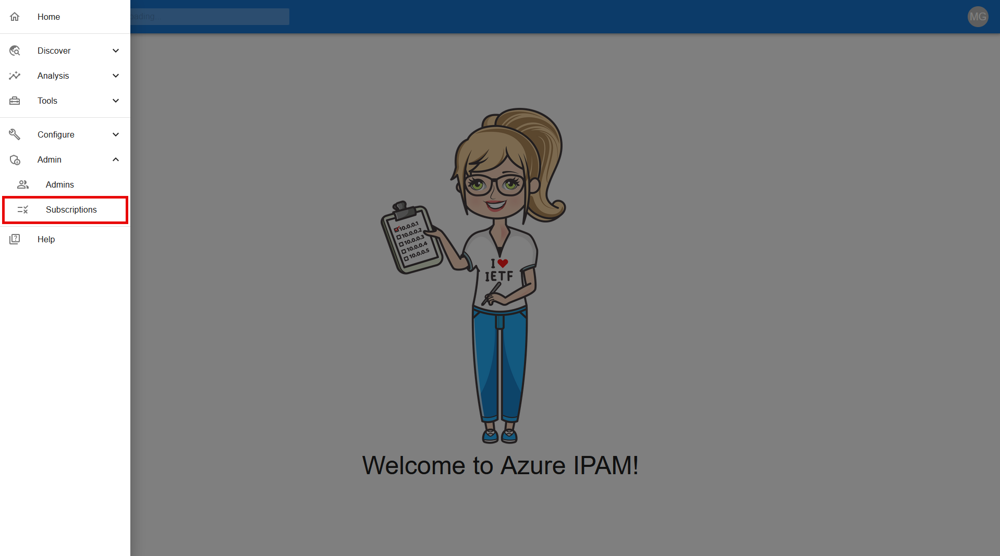

From this screen, you can select Subscriptions which are to be <u>**excluded**</u> from IPAM by clicking on them. Once selected for exclusion, the subscription will be highlighted in **red**. Don't forget to click **save** in the upper-right once complete.

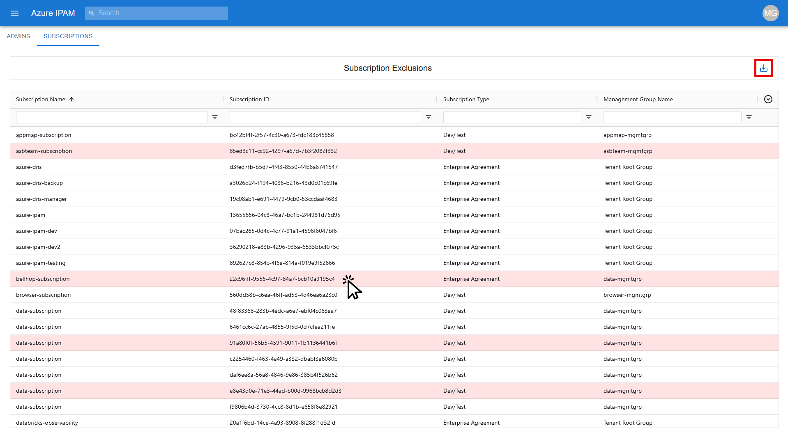

## Spaces

A **Space** represents a logical grouping of *unique* IP address space. **Spaces** can contain both contiguous and non-contiguous IP address CIDR blocks. A **Space** cannot contain any overlapping CIDR blocks. As an IPAM user, you can get to the **Spaces** tab via the **Discover** section of the menu blade. From the **Spaces** tab, you can see utilization metrics for each **Space**.

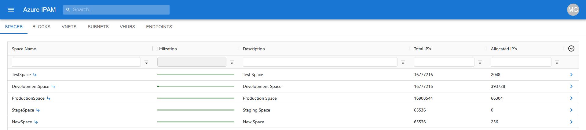

As an IPAM Administrator, you can add **Spaces** via the **Configure** section of the menu blade. Clicking on the 3 ellipses will bring up a menu of **Space** operations. Select **Add Space**.

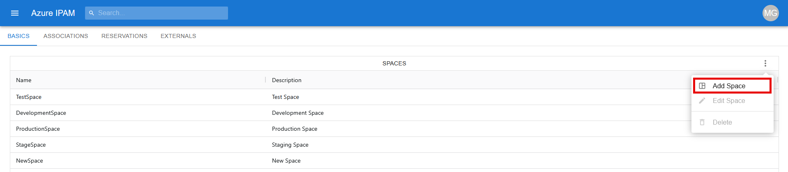

Give the new **Space** a name and a description, then click **Create** to create a new **Space**.

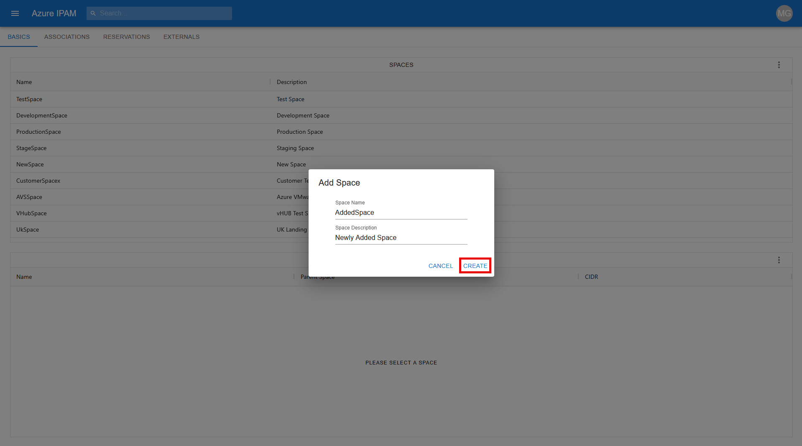

## Blocks

A **Block** represents an IP address CIDR range. It can contain vNETs whose address space resides within the defined CIDR range of the **Block**. **Blocks** cannot contain vNETs with overlapping address space. As an IPAM user, you can get to the **Blocks** tab via the **Discover** section of the menu blade. From the **Blocks** tab, you can see utilization metrics for each **Block**.

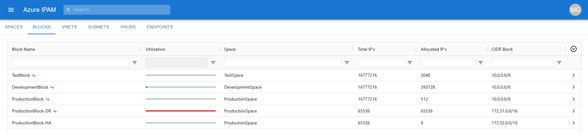

As an IPAM Administrator, you can add **Blocks** via the **Configure** section of the menu blade. After selecting which **Space** you want to add a **Block** to, clicking on the 3 ellipses will bring up a menu of **Block** operations. Select **Add Block**.

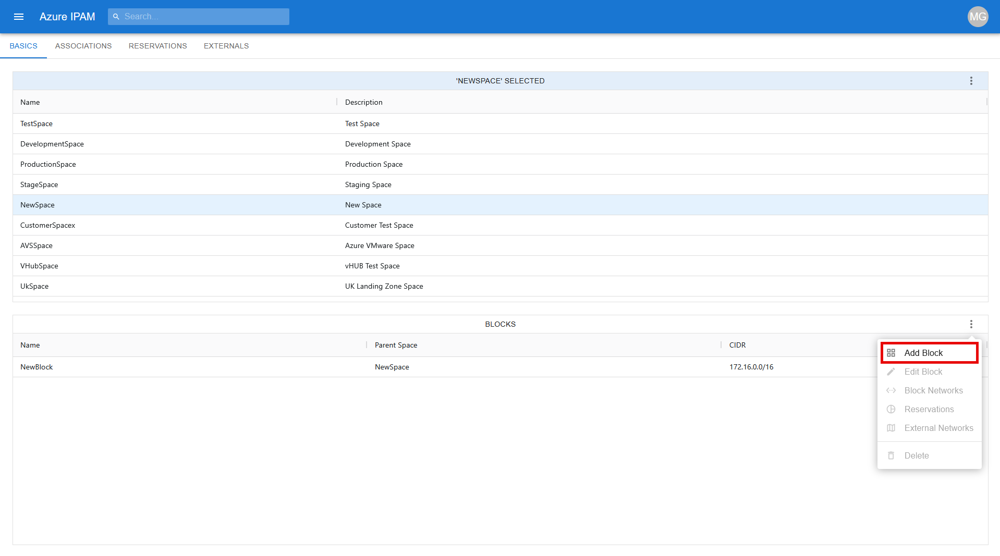

Give the new **Block** a name a valid CIDR range, then click **Create** to create add a new **Block** to the target **Space**.

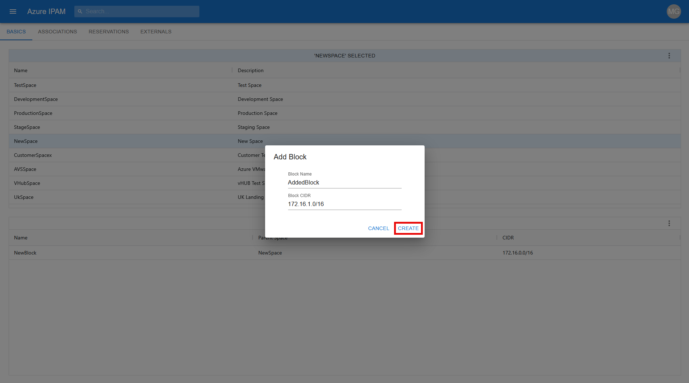

## Virtual Network Associations

Virtual Network Associations are the mechanism by which Azure virtual networks (vNETs) and virtual hubs (vHUBs) are mapped to **Blocks** in Azure IPAM. Associating a virtual network with a Block tells Azure IPAM that the network's address space is allocated from that Block's CIDR range. This is the foundation of how Azure IPAM tracks IP address utilization — without associations, Azure IPAM has no way of knowing which networks belong to which Blocks.

Associations serve several important purposes:

- **Utilization tracking** — Associated virtual networks are counted toward a Block's used address space, giving you an accurate picture of how much of the Block is consumed
- **Overlap prevention** — When creating new CIDR Reservations, External Networks, or additional associations, Azure IPAM checks against all currently associated virtual networks to prevent address collisions
- **Network visibility** — Once associated, a virtual network's subnets and endpoints become visible under their parent Block in the **Discover** section of Azure IPAM

> **Note:** Virtual Network Association management is an **IPAM Administrator** function. Only users designated as Azure IPAM admins can create or modify associations. However, all users with access to Azure IPAM can view the current associations for a Block in a read-only capacity.

### How Associations Work

Each **Block** maintains a list of associated virtual networks. An association is simply a mapping between an Azure virtual network resource ID and the Block. When Azure IPAM calculates utilization for a Block, it sums the address prefixes of all associated virtual networks that fall within the Block's CIDR range.

The association data is stored within the Block itself, alongside CIDR Reservations and External Networks:

```text
Space
└── Block (e.g. 10.0.0.0/16)
    ├── Virtual Network Associations  ← You are here
    ├── CIDR Reservations
    └── External Networks
```

Azure IPAM's background reconciliation process runs every minute and checks each associated virtual network against Azure to confirm it still exists and still has address space within the Block's CIDR range. If the network has been deleted or its address space no longer falls within the Block, it is marked as stale. Stale associations are highlighted in the UI so administrators can clean them up.

### Availability and Eligibility Rules

Not every virtual network in your Azure environment is eligible for association with a given Block. When you open the associations page for a Block, Azure IPAM queries for all virtual networks and virtual hubs across your subscriptions that meet the following requirements:

1. **CIDR containment** — The virtual network must have at least one address prefix that falls within the Block's CIDR range
2. **No CIDR overlap with Reservations** — The virtual network's address prefixes must not overlap with any unsettled (active) CIDR Reservations in the Block
3. **No CIDR overlap with External Networks** — The virtual network's address prefixes must not overlap with any External Network CIDRs in the Block

Virtual networks that are already associated with the Block are included in the available list (they appear as pre-selected in the table). Overlap with existing associations is validated when you save your changes.

Spaces are independent logical boundaries — a virtual network associated with a Block in one Space can still appear as available for Blocks in other Spaces. Within the same Space, a virtual network with multiple address prefixes can be associated with different Blocks, since Blocks in a Space cannot have overlapping CIDRs and each prefix is evaluated independently.

> **Tip:** If a virtual network or virtual hub you expect to see is missing from the available list, check whether its address space falls within the Block's CIDR range and whether it overlaps with an existing Reservation or External Network in the target Block.

### Managing Associations via the UI

Virtual Network Associations are managed from the **Configure** section of the Azure IPAM menu blade. There are two ways to get there:

**Option 1: Direct navigation** — Expand the **Configure** section of the menu blade and select **Associations**. This takes you to the Associations page where you can select a Space and Block.

**Option 2: From the Block configuration** — Navigate to **Configure → Basics**, select a Space and Block, then open the action menu (3 ellipses) and select **Block Networks**. This takes you to the Associations page with the Space and Block pre-selected.

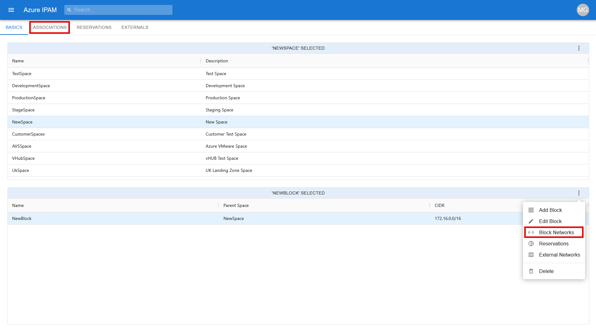

#### The Associations Page

The Associations page displays a toolbar at the top with selectors for **Space** and **Block**, a read-only **Network** field showing the Block's CIDR, and a selection counter showing how many virtual networks are currently selected out of the total available.

Below the toolbar is a data grid showing all eligible virtual networks for the selected Block. The grid displays the following columns:

- **Name** — The name of the virtual network or virtual hub
- **Type** — Whether the network is a **vNET** or a **vHUB**
- **Resource Group** — The Azure resource group containing the network
- **Subscription Name** — The Azure subscription containing the network
- **Subscription ID** — The Azure subscription ID (hidden by default)
- **Prefixes** — The address space(s) assigned to the virtual network

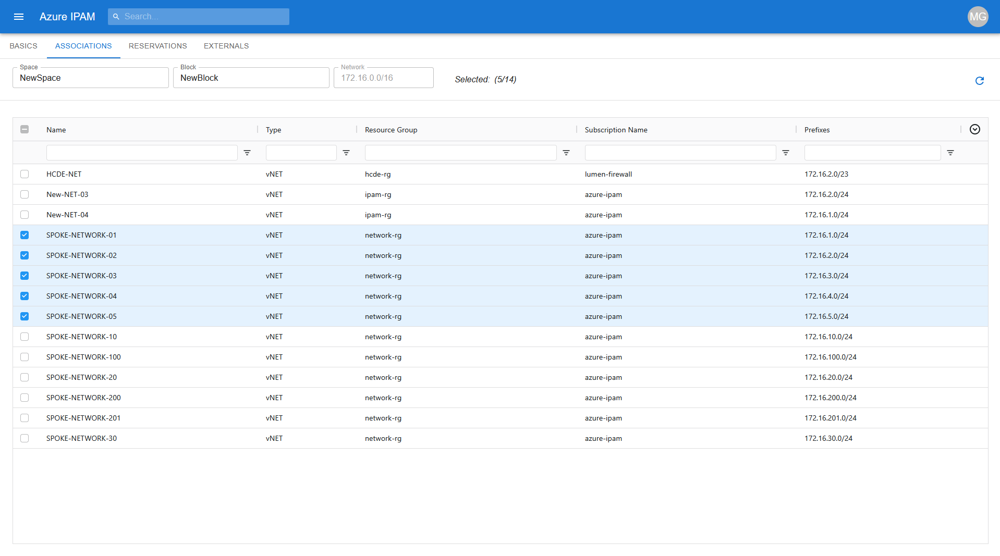

Virtual networks that are currently associated with the Block are pre-selected (checked) when the page loads.

#### Associating Virtual Networks

To associate virtual networks with a Block, place a checkmark next to each virtual network you'd like to associate. The selection counter in the toolbar updates in real time as you make changes. Once your selection differs from the current associations, a **Save** button (disk icon) appears in the toolbar.

Click **Save** to apply your changes. On success, you'll see a confirmation notification and the Block's virtual network list has been updated. Note that saving performs a **full replacement** — the Block's entire list of associated networks is replaced with whatever is currently selected in the grid.

#### Disassociating Virtual Networks

To disassociate a virtual network from a Block, simply un-check it in the grid and click **Save**. Disassociating a virtual network releases its address prefixes from the Block's utilization calculations, making that space available for new allocations.

#### Stale Associations

A virtual network can become stale if it is deleted from Azure or if its address space is changed so that it no longer falls within the Block's CIDR range. Azure IPAM's background reconciliation process detects these changes and marks the associations as inactive.

Stale associations are displayed at the top of the grid with a **red background** to draw attention. Their prefixes column will display `ErrNotFound` to indicate the network could not be located in Azure.

To clean up stale associations, un-check the stale entries and click **Save** to remove them from the Block.

#### Admin vs. Non-Admin View

Non-admin users can navigate to the Associations page and view the current associations for any Block. However, the grid is displayed in **read-only mode** — checkboxes are not shown and the Save button is never visible. This allows everyone to see which virtual networks are associated with a Block without being able to modify the associations.

> **Important:** Administrators see networks across the entire tenant. Non-admin users only see networks in subscriptions they have Azure RBAC read access to, so their available network list may be smaller.

### Automatic Association via Reservations

Virtual networks created through the CIDR Reservation workflow are **automatically associated** with their Block — no manual step is needed. Azure IPAM's background reconciliation detects the tagged network, verifies its address space, and creates the association for you. See the [Reservations](#reservations) section for details on how this works.

### How Associations Affect Utilization

When Azure IPAM calculates utilization for a Block, it considers the address prefixes of all associated virtual networks. Only prefixes that actually fall within the Block's CIDR range are counted — if a virtual network has multiple address spaces and only one falls within the Block, only that one is included in the utilization calculation.

The utilization formula for a Block is:

```text
Utilization = (Associated vNET Prefixes + External Network CIDRs) / Block Total Size
```

For example, a Block of `10.0.0.0/16` (65,536 addresses) with two associated virtual networks of `10.0.1.0/24` (256 addresses) and `10.0.2.0/24` (256 addresses) would show a utilization of 512 / 65,536 = ~1%.

> **Note:** Unsettled CIDR Reservations are excluded from the utilization percentage but are still accounted for when determining available space for new allocations.

### Managing Associations via the API

All Virtual Network Association operations are also available through the Azure IPAM REST API. For the full list of available endpoints and example calls, please see the [Virtual Network Associations](/api/README.md#virtual-network-associations) section of the API documentation.

### Tips and Best Practices

- **Associate before you plan**: Associate your existing virtual networks with their corresponding Blocks as soon as you set up Azure IPAM. This gives you an accurate utilization baseline from day one.
- **Use Reservations for new networks**: Rather than creating a virtual network in Azure and then manually associating it, use the Reservation workflow. This ensures the address space is held for you and the association happens automatically.
- **Clean up stale associations**: Periodically check for stale (red) associations and remove them. These represent virtual networks that no longer exist in Azure and inflate your association count.
- **Multi-prefix virtual networks**: Azure virtual networks can have multiple address prefixes. Because Blocks within a Space cannot have overlapping CIDRs, each prefix naturally falls under at most one Block. A virtual network with prefixes spanning multiple Blocks can be associated with each Block independently — only the prefix(es) within each Block's CIDR range will count toward that Block's utilization.
- **Watch for overlap**: If you can't associate a virtual network, check the Block's Reservations and External Networks for CIDR overlaps. An unsettled Reservation holding the same address space will block the association.

## Reservations

A **Reservation** allows you to claim a CIDR range within a **Block** before you actually create an Azure virtual Network. Think of it like placing a hold on address space, the reserved CIDR is excluded from future allocations (including new Reservations, virtual network associations, and External Networks) until the Reservation is either fulfilled or cancelled.

Reservations are useful when you need to coordinate network creation across teams or processes. For example, a platform team might reserve a /24 for a project team that isn't ready to deploy their virtual network yet. The reserved space is guaranteed to be available when they need it.

### How Reservations Work

When you create a Reservation, Azure IPAM finds the next available CIDR range of the requested size within the target Block and marks it as reserved. The Reservation is assigned a unique **Reservation ID** and a status of `Waiting`. From there, the Reservation follows a lifecycle:

1. **Waiting** — The Reservation is active and the CIDR is held. IPAM is watching for a virtual network tagged with the Reservation ID.
2. **Fulfilled** — A virtual network with the Reservation's `X-IPAM-RES-ID` tag was discovered, its address space matches the reserved CIDR, and it has been automatically associated with the Block.
3. **Cancelled by User** — An administrator or the user who created the Reservation manually cancelled it.
4. **Cancelled by Timeout** — The Reservation expired based on the configured timeout policy.
5. **Warning: CIDR Mismatch** — A virtual network with the Reservation's tag was found, but its address space does not match the reserved CIDR.
6. **Error: CIDR Overlap** — A virtual network with an overlapping CIDR has already been associated with the Block through another path.

> **Tip:** When a Reservation is created, the response includes a `tag` object containing `X-IPAM-RES-ID`. Apply this tag to your new virtual network and Azure IPAM will automatically detect it, associate the vNET with the Block, and mark the reservation as fulfilled.

### Reservation Permissions

Both Azure IPAM administrators and regular users can create and manage Reservations. However, non-admin users can only see and manage Reservations they created themselves. Administrators can view and manage all Reservations across all users.

### Managing Reservations via the UI

Reservations are managed from the **Configure** section of the Azure IPAM menu blade. Navigate to **Configure → Reservations** to access the Reservations management page.

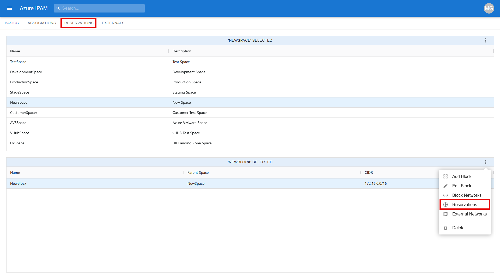

#### The Reservations Page

The Reservations page displays a table of all reservations for a given Block.

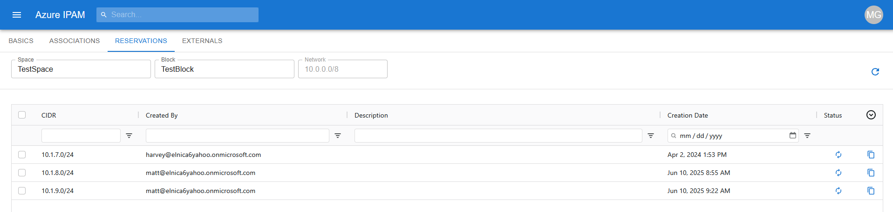

You must select both a **Space** and a **Block** before you can view or manage reservations.

> **Shortcut:** You can also navigate directly to Reservations from the **Configure → Basics** page. Select a Block, open the action menu (3 ellipses), and choose **Reservations**. This will take you to the Reservations tab with the Space and Block pre-selected.

#### Viewing Reservations

The data grid shows the following information for each Reservation:

- **CIDR** — The reserved CIDR range
- **Created By** — The user or service principal that created the Reservation
- **Description** — An optional description provided at creation time
- **Creation Date** — When the Reservation was created
- **Settled Date** — When the Reservation was fulfilled or cancelled (hidden by default)
- **Settled By** — Who or what settled the Reservation (hidden by default)
- **Status** — A status icon indicating the current state of the Reservation


#### Filtering Active vs. Settled Reservations

By default, the table shows only **active** (unsettled) Reservations. To view all Reservations, including those that have been fulfilled or cancelled, open the action menu (down chevron) and click **Showing Active** to toggle to **Showing All**. Click it again to switch back to active-only view.

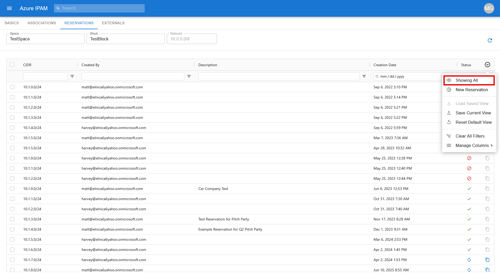

#### Creating a Reservation

To create a new Reservation, open the action menu (down chevron) and select **New Reservation**. You must have a **Space** and **Block** selected before this option becomes available.

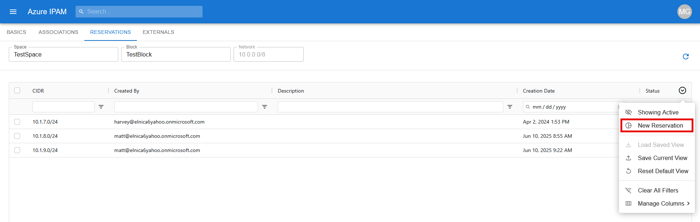

The **Create Reservation** dialog gives you two ways to specify the CIDR range. Use the **Allocation Mode** toggle to switch between them:

**Auto (default):**

Azure IPAM automatically finds the next available CIDR of the requested size. Choose a subnet **Mask** from the dropdown (available masks are based on the Block's CIDR range). You can also configure two optional search behaviors:

- **Reverse Search** — When enabled, Azure IPAM allocates from the *end* of the Block rather than the beginning. This is useful when you want to keep the beginning of the Block available for larger allocations.
- **Smallest CIDR** — When enabled, Azure IPAM uses the *smallest available* contiguous block that fits the requested size, rather than the first one it finds. This helps avoid fragmenting large open ranges.

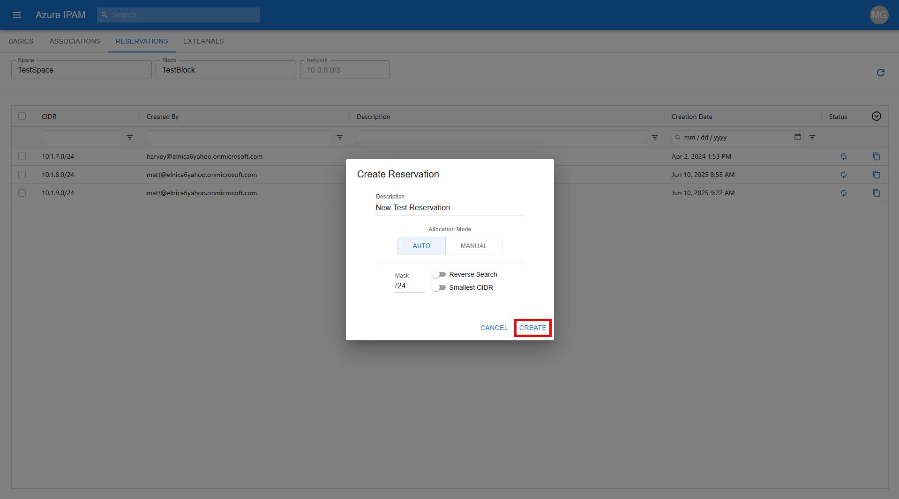

**Manual:**

Enter a specific CIDR range in standard notation (e.g., `10.1.5.0/24`). The CIDR must be within the Block's range and cannot overlap any existing virtual networks, Reservations, or External Networks.

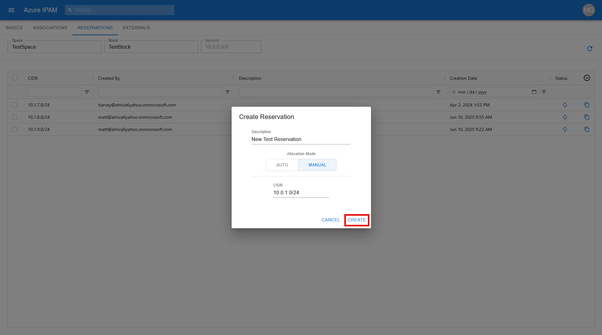

Optionally, you can add a **Description** to help identify the purpose of the Reservation.

Click **Create** to submit the Reservation. On success, you'll see a confirmation notification and the new Reservation will appear in the grid.

#### Copying a Reservation ID

Each active Reservation has a copy icon in the actions column. Click it to copy the **Reservation ID** to your clipboard. You'll need this ID to tag your virtual network so Azure IPAM can automatically associate it with the Block when the virtual nertwork is created.

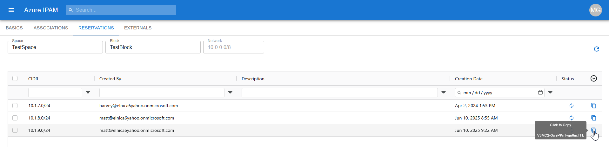

> **Tip:** The copy icon is only available for unsettled Reservations. Once a Reservation is fulfilled or cancelled, the ID is no longer actionable.

#### Cancelling Reservations

To cancel one or more Reservations, select them using the checkboxes in the table, then click the **Remove** button (red X icon) in the upper-right corner of the page.

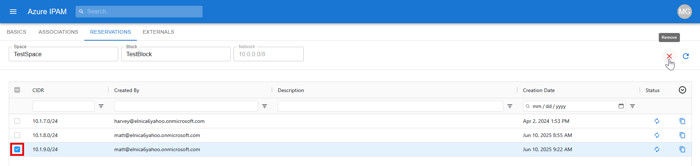

Cancelled Reservations are not completely removed, instead they are marked as **Cancelled by User** and remain visible when viewing all Reservations. This provides an audit trail of Reservation activity.

### Using the Reservation Tag

The key to automating the Reservation workflow is the `X-IPAM-RES-ID` tag. When you create a Reservation, Azure IPAM returns a tag value in the response. Apply this tag to the Azure virtual network you create with the reserved CIDR:

```text
Tag Key:   X-IPAM-RES-ID
Tag Value: <reservation-id>
```

Azure IPAM's background reconciliation process periodically scans for virtual networks with this tag. When it finds a match, it:

1. Verifies the virtual network's address space against the reserved CIDR
2. Associates the virtual network with the Block
3. Marks the Reservation as **Fulfilled**

This tag-based approach means you can create the Reservation through Azure IPAM and then create the virtual network through any mechanism you prefer: Azure Portal, CLI, PowerShell, Terraform, Bicep, or any other IaC tool.

### Multiple Reservations on a Single Virtual Network

Azure Virtual Networks support multiple address spaces (prefixes). If your virtual network has more than one address space, each address space that falls within a Block must have its own Reservation. The `X-IPAM-RES-ID` tag supports this by accepting a **comma-separated list** of Reservation IDs in a single tag value:

```text
Tag Key:   X-IPAM-RES-ID
Tag Value: <reservation-id-1>,<reservation-id-2>,<reservation-id-3>
```

The reconciliation engine strips all whitespace from the tag value before parsing, so spaces around the commas are harmless, but the canonical format is no spaces:

```text
Tag Key:   X-IPAM-RES-ID
Tag Value: ABNsJjXXyTRDTRCdJEJThu,XKp7mQeNvLCsWbYdFgHiRZ
```

Each Reservation ID in the list is evaluated independently. For every ID found, the engine:

1. Looks up the corresponding Reservation
2. Verifies that the virtual network has an address space matching the Reservation's reserved CIDR
3. Associates the virtual network with the Block (if not already associated)
4. Marks that individual Reservation as **Fulfilled**

Because each Reservation ID is processed separately, a virtual network with two address spaces can carry two Reservation IDs in a single tag and both Reservations will be fulfilled in the same reconciliation cycle.

> **Note:** Each Reservation ID in the list is evaluated independently. The IDs do not need to belong to the same Block — a virtual network with two address spaces can have one address space associated to one Block and the other to an entirely different Block (or even a different Space), each with its own Reservation ID in the list. A mismatch between a reserved CIDR and the virtual network's address space will result in a `Warning: CIDR Mismatch` status for that individual Reservation, regardless of the other Reservation IDs in the list.

### Managing Reservations via the API

All Reservation operations are also available through the Azure IPAM REST API. For the full list of available endpoints and example calls, please see the [CIDR Reservations](/api/README.md#cidr-reservations) section of the API documentation.

### Tips and Best Practices

- **Use descriptions**: Always add a description when creating a Reservation so it's clear what the Reservation is for, especially in environments with multiple teams
- **Copy the tag immediately**: After creating a Reservation, copy the Reservation ID right away and store it somewhere accessible. You'll need it to tag your virtual network.
- **Match your CIDR exactly**: When creating a virtual network to fulfill a Reservation, make sure the virtual network's address space matches the reserved CIDR exactly. A mismatch will result in a warning status.
- **Monitor reservation status**: Check in on your Reservations periodically. A Reservation stuck in "Waiting" may indicate the virtual network was created without the proper tag.
- **Use Reverse Search for large Blocks**: If you have a large Block and want to avoid fragmenting the beginning of the range, enable **Reverse Search** to allocate from the end.
- **Use Smallest CIDR to reduce fragmentation**: Enable **Smallest CIDR** when you want to preserve larger contiguous ranges for future use
- **Multiple address spaces require multiple Reservations**: If your virtual network will have more than one address space, create a separate Reservation for each prefix and set the `X-IPAM-RES-ID` tag value to a comma-separated list of all Reservation IDs (e.g., `id1,id2`)

## vNETs, Subnets, and Endpoints

As an IPAM user, you can view IP address utilization information and detailed Azure resource related information for **vNETs**, **Subnets**, and **Endpoints** you have existing Azure RBAC access to.

### Virtual Networks

For **vNETs**, you can find the name, view the parent **Block** (if assigned), utilization metrics, and the **vNET** address space(s).

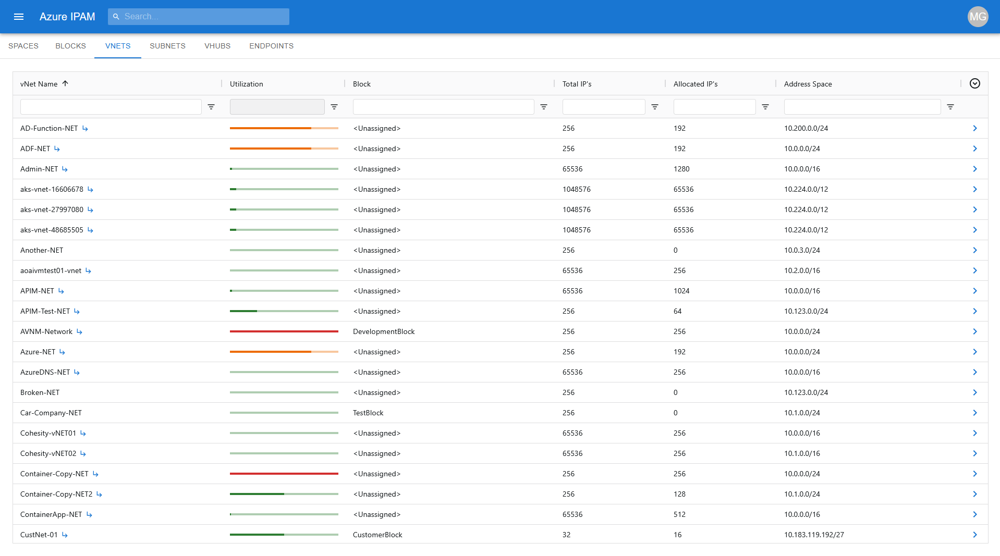

By clicking to expand the **vNET** details, you can find more granular **vNET** information and are presented the option to view the **vNET** resource directly in the Azure Portal by clicking on **VIEW IN PORTAL**.

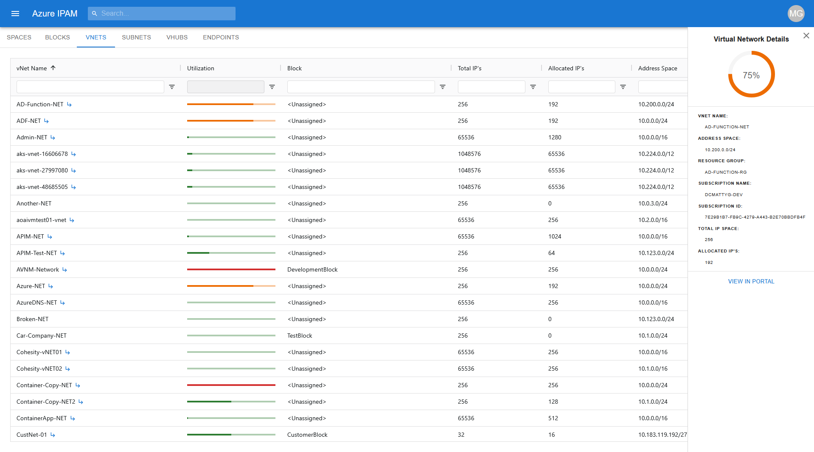

### Subnets

For **Subnets**, you can find the name, view the parent **vNET**, utilization metrics, and the **Subnet** address range.

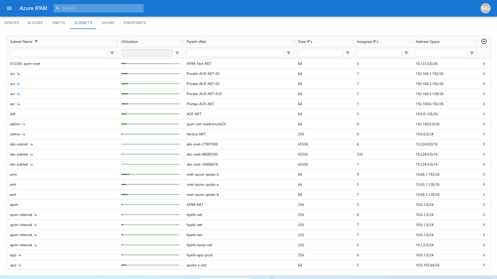

By clicking to expand the **Subnet** details, you can find more granular **Subnet** information and are presented the option to view the **Subnet** resource directly in the Azure Portal by clicking on **VIEW IN PORTAL**.

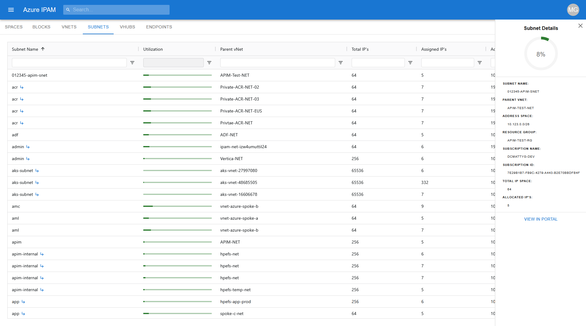

### Endpoints

For **Endpoints**, you can find the name, view the parent **vNET** and **Subnet**, Resource Group, and the private IP of the **Endpoint**

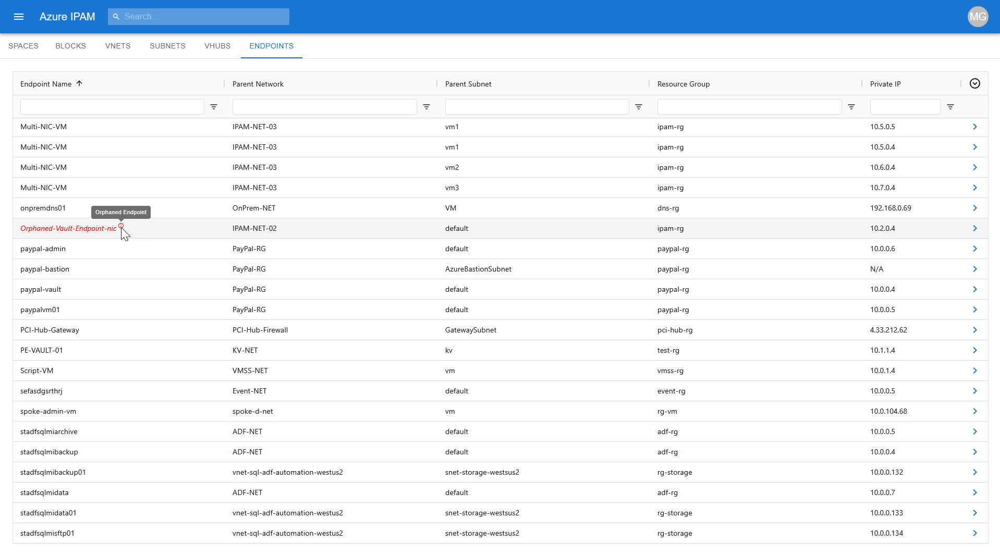

By clicking to expand the **Endpoint** details, you can find more granular **Endpoint** information (which varies based on the endpoint type) and are presented the option to view the **Endpoint** resource directly in the Azure Portal by clicking on **VIEW IN PORTAL**.

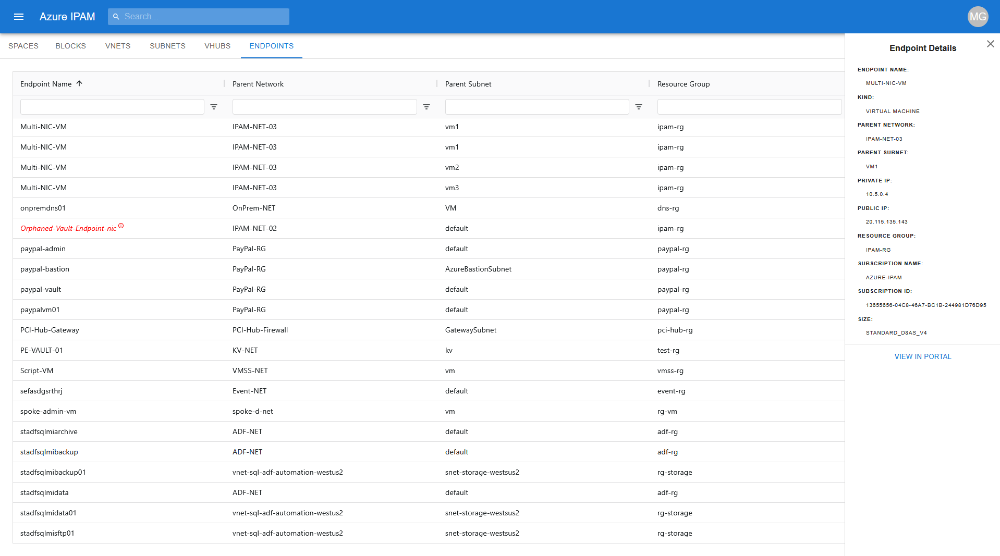

## External Networks

Azure IPAM is primarily designed to discover and manage IP address space within Azure. However, many organizations also need to track IP address utilization for networks that exist **outside of Azure**. This could include on-premises datacenter networks, co-location facilities, other cloud providers, or any IP space that is part of your overall enterprise addressing scheme but is not natively managed by Azure.

**External Networks** in Azure IPAM were designed to address this need. They allow you to:

- **Map non-Azure CIDR ranges** within your existing Blocks to indicate that the address space is allocated elsewhere
- **Define subnets** within those External Networks to represent the various network segments where endpoints reside
- **Track individual endpoints** within those subnets, including their names, descriptions, and IP addresses
- **Prevent address conflicts** by accounting for externally managed IP space when planning new Azure network deployments or creating CIDR reservations

> **Note:** External Network management is an **IPAM Administrator** function. Only users designated as Azure IPAM admins can create, modify, or delete External Networks, Subnets, and Endpoints. However, all users with access to IPAM can view the Manage Endpoints dialog for external subnets.

### How External Networks Fit Into the IPAM Hierarchy

External Networks live within the existing **Space → Block** hierarchy. A **Block** represents a CIDR range and can contain Azure virtual networks, CIDR reservations, *and* External Networks. The full hierarchy looks like this:

```text
Space
└── Block (e.g. 10.0.0.0/16)
    ├── Azure Virtual Networks
    ├── CIDR Reservations
    └── External Networks (e.g. 10.0.100.0/24)
        └── External Subnets (e.g. 10.0.100.0/26)
            └── External Endpoints (e.g. 10.0.100.5)
```

When Azure IPAM calculates available address space within a Block (for example, when creating a new CIDR reservation or evaluating utilization), it accounts for External Networks alongside Azure virtual networks and existing Reservations. This ensures that externally allocated space is never accidentally double-assigned.

### Managing External Networks via the UI

External Networks are managed from the **Configure** section of the Azure IPAM menu blade. Navigate to **Configure → Externals** to access the External Networks management page.

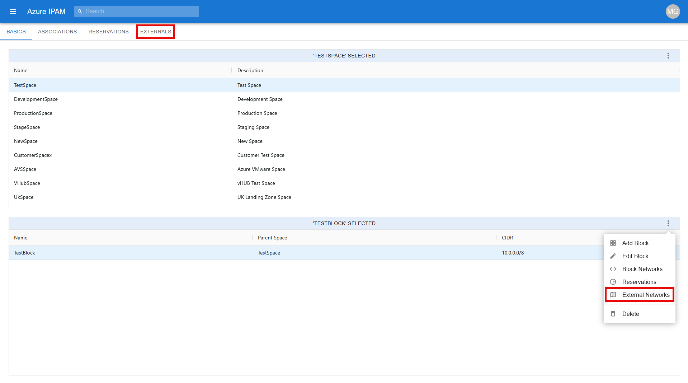

#### The Externals Configuration Page

The Externals page presents a split-pane view. The upper half displays **External Networks** for the selected Block, and the lower half displays **Subnets** for the currently selected External Network.

At the top of the page, you'll find selectors for **Space** and **Block**. You must select both a Space and a Block before you can view or manage External Networks.

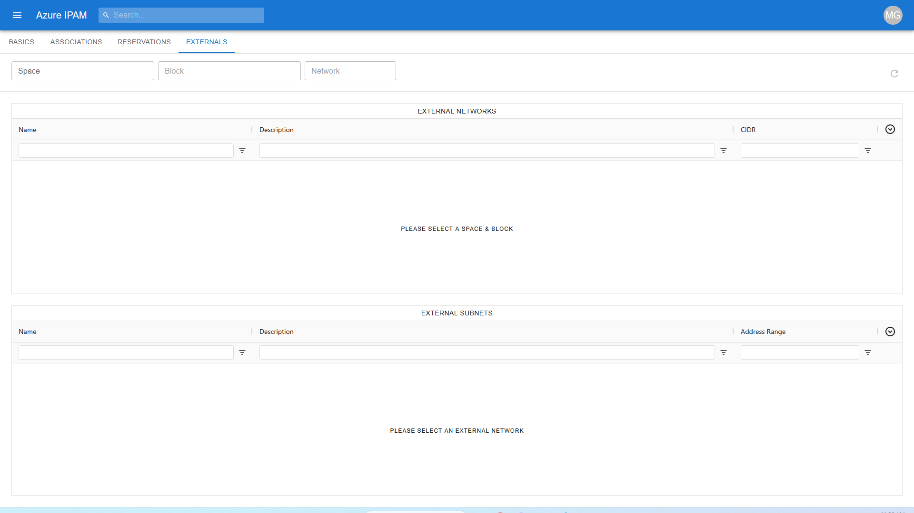

#### Adding an External Network

To add a new External Network, first select the target **Space** and **Block** using the dropdowns at the top. Then, open the action menu (down chevron) on the External Networks grid and select **Add Network**.

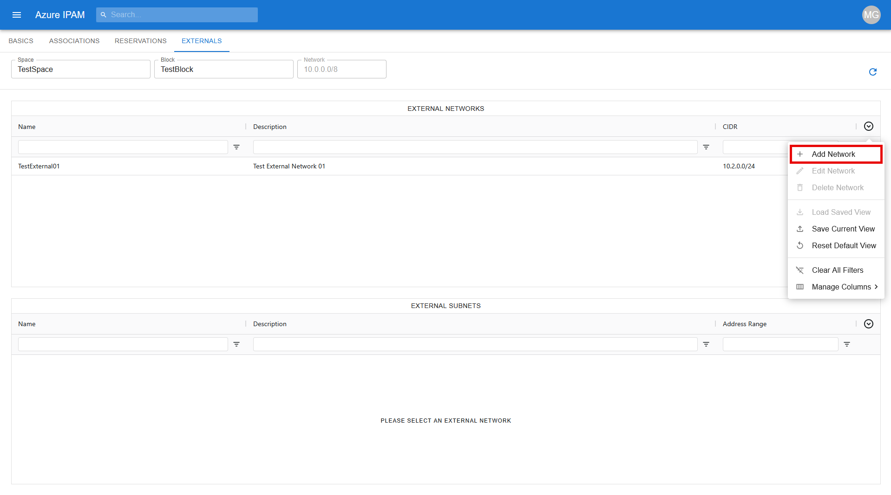

You will be presented with a dialog to define the new External Network:

- **Name**: A unique name for the External Network (up to 64 characters; alphanumerics, underscores, hyphens, and periods are allowed)
- **Description**: A description of the External Network (up to 128 characters; alphanumerics, spaces, underscores, hyphens, slashes, and periods are allowed)
- **CIDR**: Use the **Allocation Mode** toggle to specify the network size in one of two ways:
  - **Auto**: Select a subnet mask size, and Azure IPAM will automatically assign the next available CIDR within the Block
  - **Manual**: Specify an exact CIDR range (must be within the parent Block and cannot overlap existing virtual networks, Reservations, or other External Networks)

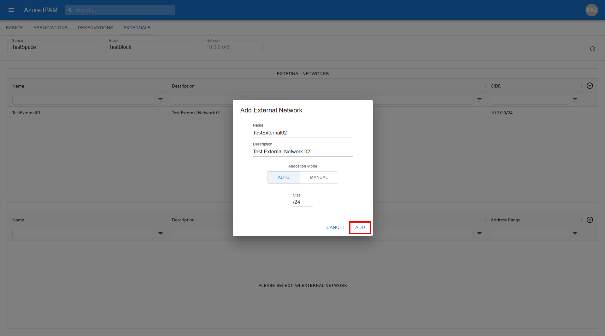

Once created, the External Network will appear in the table, and its CIDR range will be accounted for in the Block's utilization metrics.

#### Editing an External Network

To edit an existing External Network, select the network in the table, then open the action menu and select **Edit Network**.

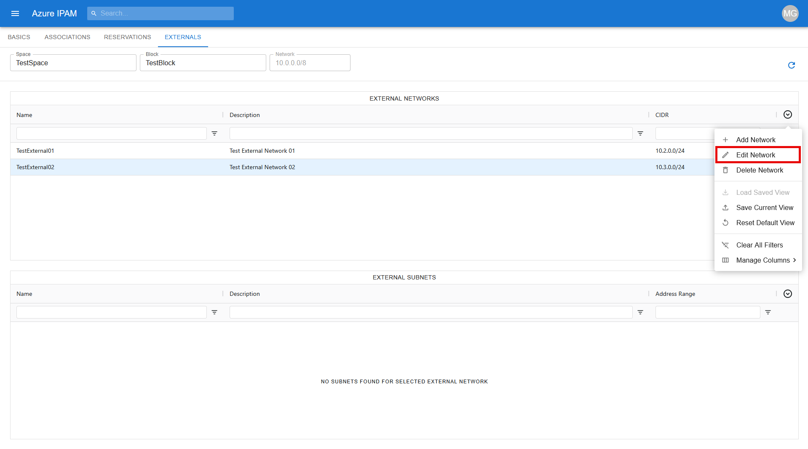

You can update the **Name**, **Description**, and **CIDR** of the External Network. The same validation rules apply as when creating a new network, the updated CIDR must remain within the parent Block and cannot overlap other allocated space.


#### Deleting an External Network

To delete an External Network, select it in the table, open the action menu, and select **Delete Network**.

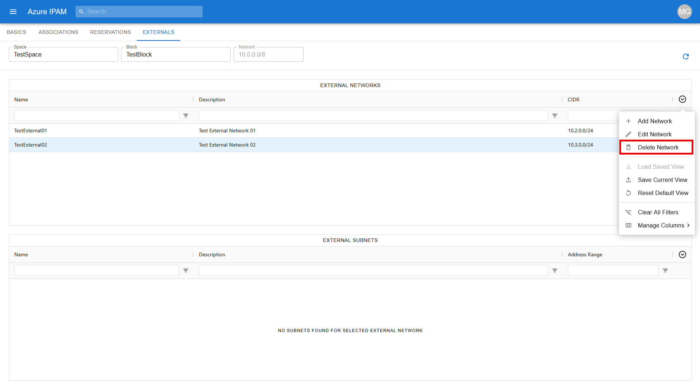

You will be asked to confirm the deletion. If the External Network contains subnets, you will need to enable the **Force Delete** option and confirm a second time before the deletion proceeds.

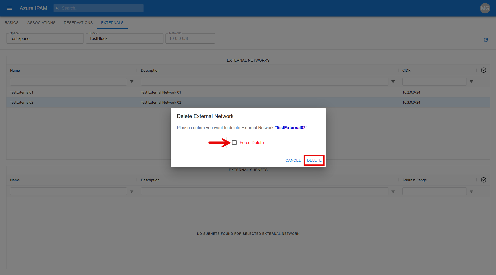

### Managing External Subnets

External Subnets represent the individual network segments within an External Network. These could correspond to physical subnets in an on-premises datacenter, VLANs, or any other logical network division.

#### Viewing External Subnets

When you select an External Network in the upper table, the lower table will populate with its associated Subnets. Each subnet displays its **Name**, **Description**, and **Address Range** (CIDR).

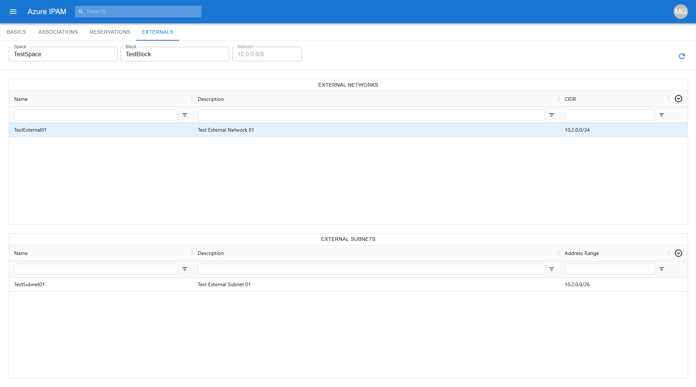

#### Adding an External Subnet

With an External Network selected, open the action menu on the Subnets table and select **Add Subnet**.

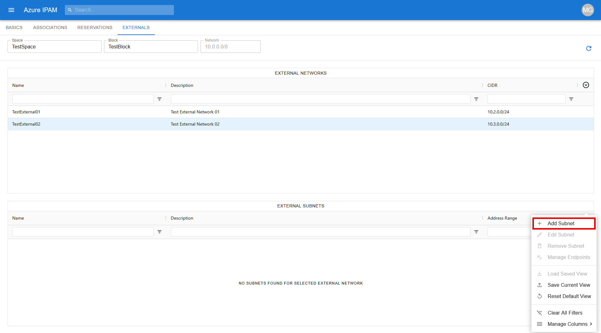

Define the subnet with the following details:

- **Name**: A unique name within the parent External Network (up to 64 characters)
- **Description**: A description of the subnet (up to 128 characters)
- **CIDR**: Use the **Allocation Mode** toggle to specify either by **Auto** (automatic assignment) or by **Manual** (must fall within the parent External Network's CIDR range and cannot overlap sibling subnets)

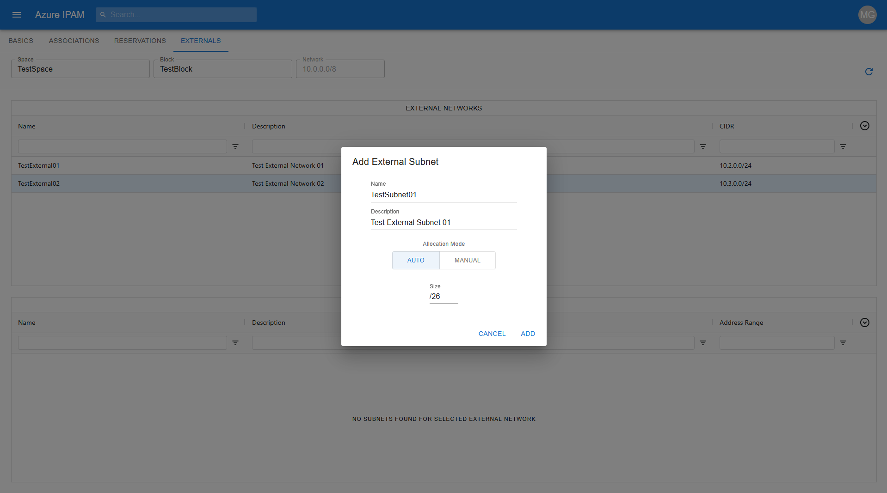

#### Editing an External Subnet

Select a Subnet in the lower table, open the action menu, and select **Edit Subnet** to modify its name, description, or CIDR.

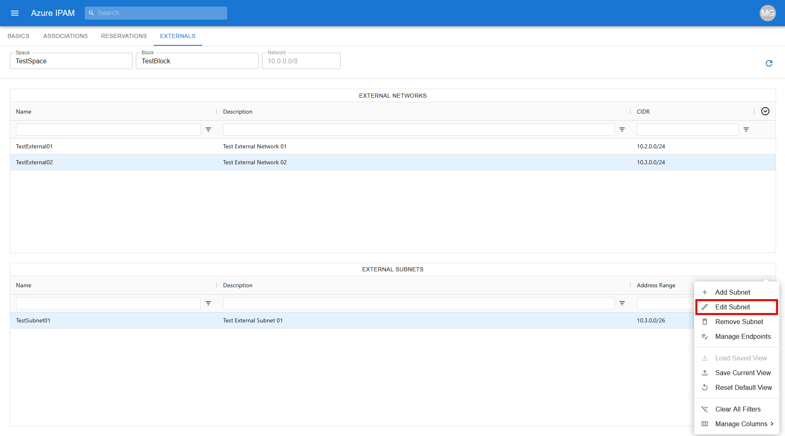

#### Deleting an External Subnet

Select a Subnet, open the action menu, and choose **Remove Subnet**. If the subnet contains endpoints, you will need to use the **Force Delete** option.

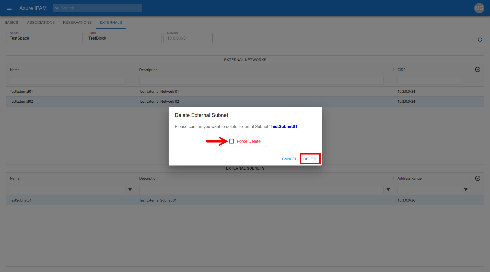

### Managing External Endpoints

External Endpoints represent individual hosts or devices within an External Subnet. This is where you can track specific machines, appliances, or services along with their IP assignments.

#### Opening the Manage Endpoints View

Select a Subnet in the lower table, then open the action menu and select **Manage Endpoints**. This opens a full-width dialog for managing all endpoints within the selected subnet.

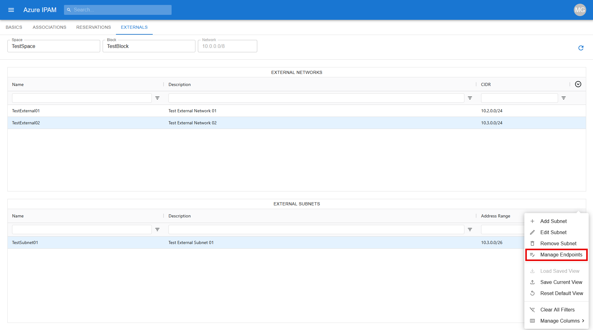

#### The Manage Endpoints Dialog

The Manage Endpoints dialog is divided into two sections:

1. **Add/Edit Form** (top): Fields for **Name**, **Description**, and **IP Address** with an action button to add or update an endpoint
2. **Existing Endpoints Table** (bottom): A table showing all current endpoints with their names, descriptions, and IP addresses

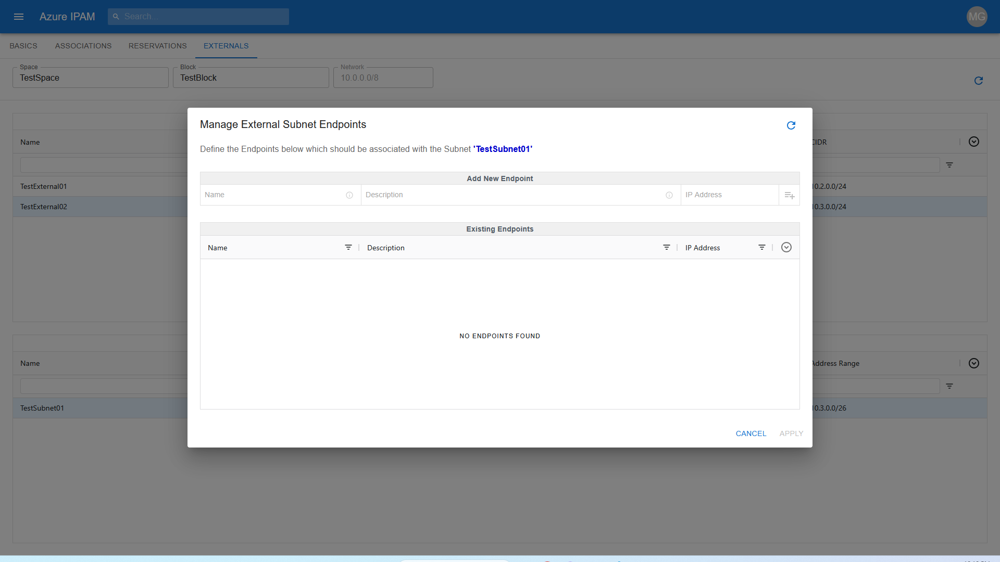

#### Adding an Endpoint

Fill in the endpoint details in the form at the top of the dialog:

- **Name**: A unique name for the endpoint (up to 64 characters)
- **Description**: A description of the endpoint (up to 128 characters)
- **IP Address**: Select an available IP address from the dropdown, or choose **\<auto\>** to have Azure IPAM assign the next available IP within the subnet

Click **Add** to stage the endpoint. You can add multiple endpoints before saving.


> **Tip:** The IP Address dropdown automatically shows only the available (unassigned) IP addresses within the subnet's CIDR range.

#### Editing an Endpoint

Click on an existing endpoint row in the table to load it into the form at the top. Modify the desired fields, then click **Update** to stage the change.

#### Deleting Endpoints

To delete an endpoint, first click the row in the table to select it. The delete icon will appear in that row once it is selected. Click the delete icon to stage the endpoint for deletion.

#### Saving Endpoint Changes

All endpoint changes (additions, updates, and deletions) are staged locally in the dialog. Once you are satisfied with the changes, click **Save** to commit them all at once. This replaces the full endpoint list for the subnet in a single operation.


### Managing External Networks via the API

All External Network operations are also exposed via the Azure IPAM REST API. You can manage External Networks, Subnets, and Endpoints programmatically just as you would any other Azure IPAM resource. For the full list of available API endpoints and example calls, please see the [External Networks](/api/README.md#external-networks) section of the API documentation.

Additionally, for guidance on integrating External Network management into automated workflows, see the [Automation](/automation/README.md) documentation.

### Tips and Best Practices

- **Use descriptive names**: Name your External Networks and External Subnets in a way that makes their physical or logical location immediately clear (e.g., `DC1-Floor2-ServerVLAN`, `AWS-US-East-1-VPC`)
- **Keep it current**: External Networks are only as useful as they are accurate. Consider automating synchronization with your existing network management tools
- **Leverage auto-assignment**: When adding endpoints, use the auto-assign IP feature (`ip: null` in the API, or `<auto>` in the UI) to let IPAM track the next available address
- **Plan before you allocate**: Since External Network CIDRs are accounted for in Block utilization calculations, adding them *before* creating new Azure virtual networks ensures you won't accidentally encounter overlap
- **Use force delete judiciously**: The force delete option on External Networks and External Subnets will remove all child objects. Use it carefully, especially in production environments
