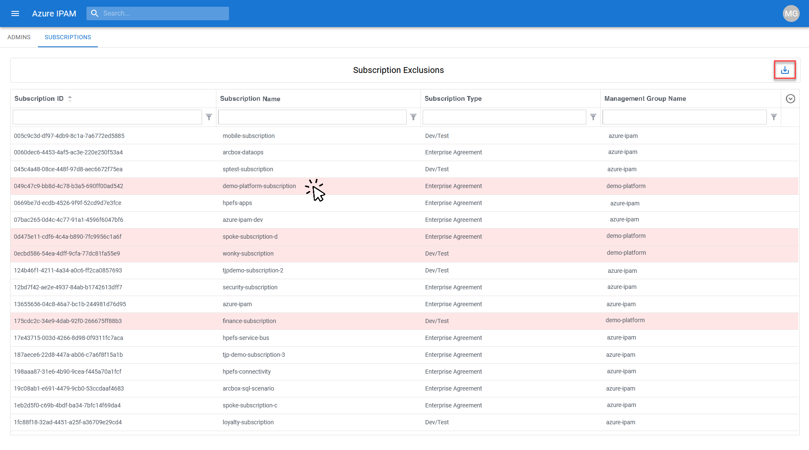
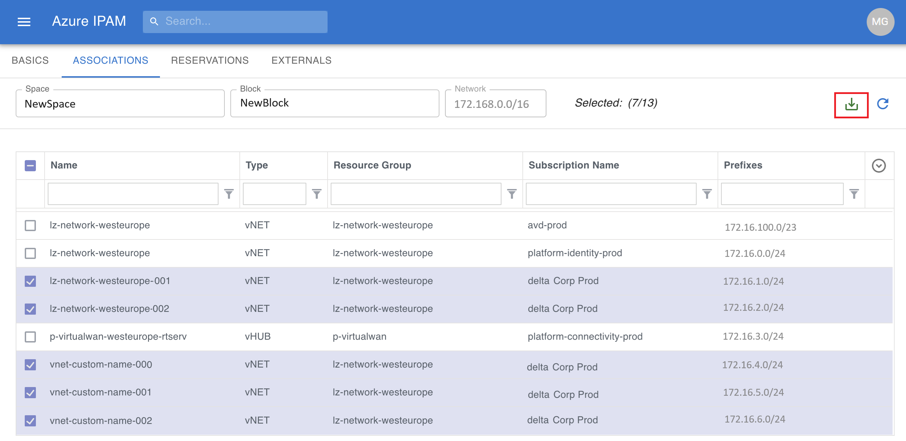
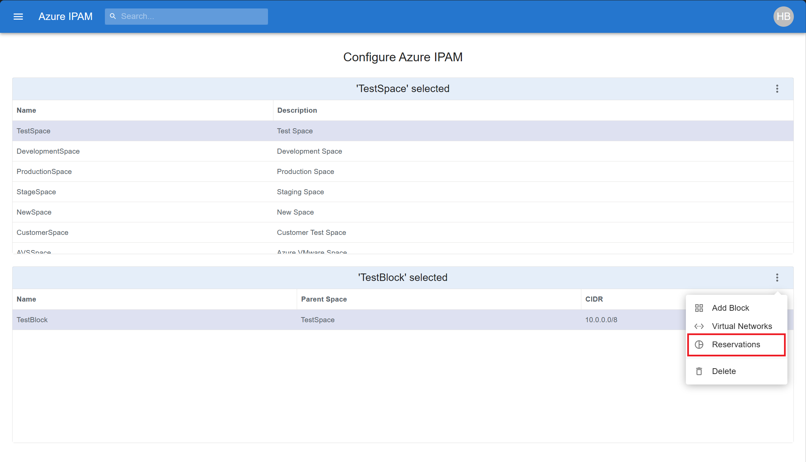

# How to Use IPAM

## Authentication and Authorization


IPAM leverages the [Microsoft Authentication Library (MSAL)](https://docs.microsoft.com/en-us/azure/active-directory/develop/msal-overview) in order to authenticate users. It uses your existing Azure AD credentials to authenticate you and leverages your existing Azure RBAC permissions to authorize what information is visible from within the IPAM tool.

IPAM has the concept of an **IPAM Administrator**. While using the IPAM tool as an administrator, you are viewing Azure resources through the permissions of the Engine Service Principal, which has [Reader](https://learn.microsoft.com/en-us/azure/role-based-access-control/built-in-roles#reader) at the [Tenant Root Management Group](https://learn.microsoft.com/en-us/azure/governance/management-groups/overview#root-management-group-for-each-directory) level. Upon initial deployment, no IPAM administrators are set which has the effect of **all** users having administrative rights. You can define who within your Azure AD Tenant should be designated as an IPAM administrator via the **Admin** section of the menu blade.


IPAM administrators have the ability to perform CRUD operations on  [Spaces](#spaces) and [Blocks](#blocks) via the **Configure** section of the menu blade (more on that below). Once at least one IPAM administrator is set, non-admin users will only see resources in IPAM they already have access to from the Azure Portal via their Azure RBAC permissions, and the administrative functions of the IPAM tool will no longer be available to them.


## Subscription Exclusion/Inclusion

As an IPAM administrator, you have the ability to include/exclude Subscriptions from the IPAM view. To do so, expand the **Admin** section of the menu blade and select **Subscriptions**.


From this screen, you can select Subscriptions which are to be <ins>**excluded**</ins> from IPAM by clicking on them. Once selected for exclusion, the Subscription will be highlighted in **red**. Don't forget to click **save** in the upper-right once complete.



## Spaces

A **Space** represents a logical grouping of *unique* IP address CIDR blocks. **Spaces** can contain both contiguous and non-contiguous IP address CIDR blocks. A **Space** cannot contain any overlapping CIDR blocks. As an IPAM user, you can get to the **Spaces** tab via the **Discover** section of the menu blade. From the **Spaces** tab, you can see utilization metrics for each **Space**.


As an IPAM Administrator, you can add **Spaces** via the **Configure** section of the menu blade. Clicking on the 3 ellipses will bring up a menu of **Space** operations. Select **Add Space**.


Give the new **Space** a name and a description, then click **Create** to create a new **Space**.


## Blocks

A **Block** represents an IP address CIDR range. It can contain vNETs whose address space resides within the defined CIDR range of the **Block**. **Blocks** cannot contain vNETs with overlapping address space. As an IPAM user, you can get to the **Blocks** tab via the **Discover** section of the menu blade. From the **Blocks** tab, you can see utilization metrics for each **Block**.


As an IPAM Administrator, you can add **Blocks** via the **Configure** section of the menu blade. After selecting which **Space** you want to add a **Block** to, clicking on the 3 ellipses will bring up a menu of **Block** operations. Select **Add Block**.


Give the new **Block** a name a valid CIDR range, then click **Create** to create add a new **Block** to the target **Space**.


## Virtual Network Association

As an IPAM Administrator, you can associate Azure Virtual Networks to **Blocks**. In order to associate a Virtual Network to a **Block**, the Virtual Network cannot be associated to another **Block** within the **Space** and there cannot be any unfulfilled **Reservations** in the **Block** that overlap with the Virtual Network's CIDR. 

To associate a Virtual Network to a **Block**, select the **Block** you want to associate the Virtual Network to, then click on the 3 ellipses to bring up a menu of **Block** operations. Select **Virtual Networks**.


Place a checkmark next to the Virtual Networks you'd like to associate to the target **Block**, or un-check Virtual Networks you'd like to disassociate from the target **Block**, then click **Apply**.



## Reservations

IP CIDR block reservations are not supported via the UI, but are supported programmatically via the API. When creating a reservation, IPAM will provide you with the next available CIDR block from the target **Block** you are requesting a reservation from that matches the bit mask size in your request. As a result, a GUID is generated for the reservation. Tagging your vNET with that GUID will complete the reservation process and associate the newly created vNET to the target **Block**.

For requesting an IP address CIDR reservation, you'll need to perform a POST to the reservation API endpoint of the target **Block**:
````
https://<my-ipam-instance>.azurewebsites.net/api/spaces/<my-target-space>/blocks/<my-target-block>/reservations
````

You'll need to provide the following when making the call:
* A bearer token
* The method
* The request URL
* Any headers you'd like to pass
* The body of the request

The body of your request needs to contains a bit mask size. Based on this, IPAM will provide the next available CIDR block that matches the requested bit mask size.


Be sure to provide the appropriate headers under the **Headers** tab.


Lastly, don't forget to provide your token information under the **Authorization** tab.


After POSTing your request, you will recieve a response of type **201 Created** with key information regarding your CIDR block reservation request (make note of the tag that is returned in the response). 


In IPAM, you can see your reservation by navigating to the target **Block**, clicking on the 3 elipses, and selecting **Reservations**. 



In the **Block Reservations** page, you will see your newly created **Reservation**. Hovering over the copy icon will present the GUID which should match the GUID returned from your API request. 


Tagging your newly created VNET with a key:value of :
````
ipam-res-id: <my reservation guid>
````


will automatically associate it with the target **Block** the reservation was requested from.

For more information on how to make API calls and a more detailed example of creating a reservation, head over to our [API documentation page.](../api/README.md?)

## vNETs, vWAN Hubs, Subnets, and Endpoints

As an IPAM user, you can view IP address utilization information and detailed Azure resource related information for **vNETs**, **vWAN Hubs**, **Subnets**, and **Endpoints** you have existing Azure RBAC access to.

### Virtual Networks

For **vNETs**, you can find the name, view the parent **Block** (if assigned), utilization metrics, and the **vNET** address space(s).


By clicking to expand the **vNET** details, you can find more granular **vNET** information and are presented the option to view the **vNET** resource directly in the Azure Portal by clicking on **VIEW IN PORTAL**.


### vWAN Hubs

For **vWAN Hubs**, you can find the name, view the parent **vWAN**, the parent **Block** (if assigned), the resource group it is associated to, and the **vWAN Hub** address space.


By clicking to expand the **vWAN Hub** details, you can find more granular **vWAN Hub** information and are presented the option to view the **vWAN Hub** resource directly in the Azure Portal by clicking on **VIEW IN PORTAL**.


### Subnets

For **Subnets**, you can find the name, view the parent **vNET**, utilization metrics, and the **Subnet** address range.


By clicking to expand the **Subnet** details, you can find more granular **Subnet** information and are presented the option to view the **Subnet** resource directly in the Azure Portal by clicking on **VIEW IN PORTAL**.


### Endpoints

For **Endpoints**, you can find the name, view the parent **vNET** and **Subnet**, Resource Group, and the private IP of the **Endpoint**


By clicking to expand the **Endpoint** details, you can find more granular **Endpoint** information (which varies based on the endpoint type) and are presented the option to view the **Endpoint** resource directly in the Azure Portal by clicking on **VIEW IN PORTAL**.


