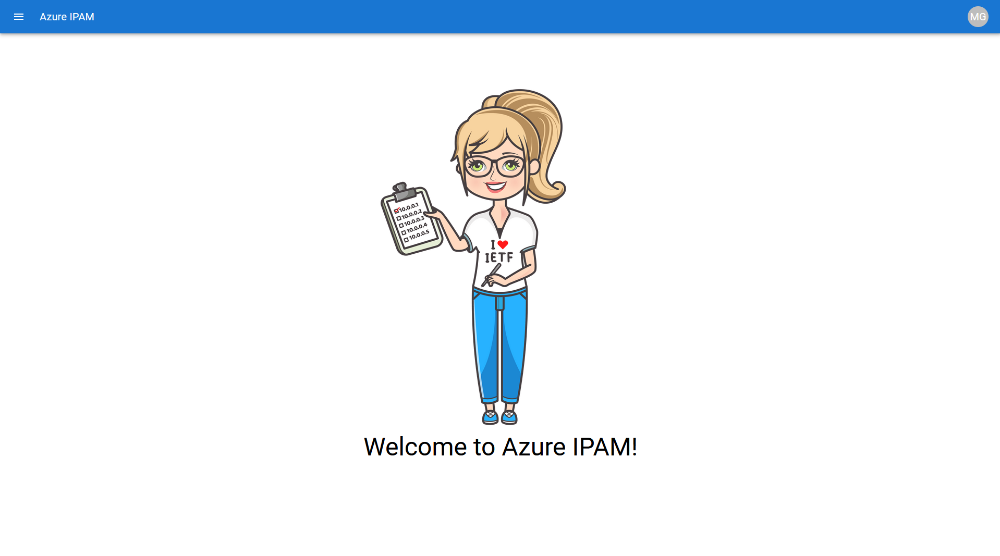
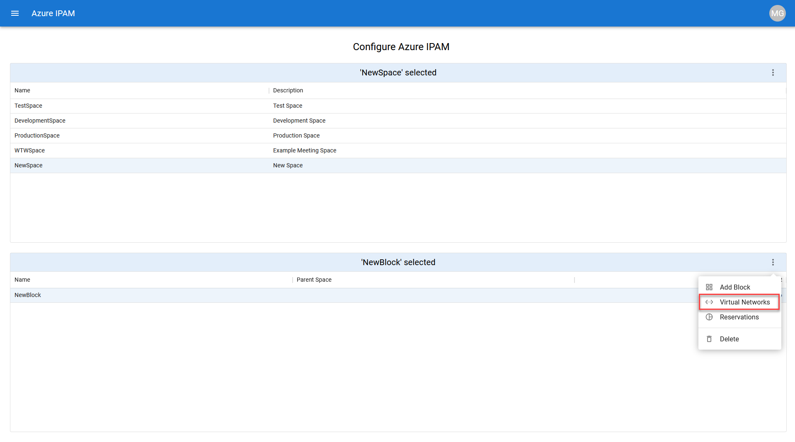

## How to Use IPAM

### Authentication and Authorization

IPAM leverages the [Microsoft Authentication Library (MSAL)](https://docs.microsoft.com/en-us/azure/active-directory/develop/msal-overview) in order to authenticate users. It uses your Azure AD credentials to authenticate you and then leverages your existing Azure RBAC permissions to authorize what you can and cannot see. 

IPAM has the concept of an **IPAM Administrator**. Upon initial deployment, you can define who within your Azure AD Tenant should be designated as an IPAM Administrator via the **Admin** section of the menu blade.

IPAM Administrators have the ability to configure IPAM with "Spaces" and "Blocks" via the **Configure** section of the menu blade (more on that later). When logging in as an IPAM Administrator, MSAL is bypassed and the Engine Service Principal provides the RBAC permission (Reader at the Tenant Root) to view all IP address management related resources across the entire Azure Tenant.

### Spaces

A **Space** represents a logical grouping of IP address CIDR blocks. **Spaces** can contain both contiguous and non-contiguous IP address CIDR blocks. A **Space** cannot contain overlapping IP address CIDR blocks. As an IPAM user, you can get to the **Spaces** tab via the **Discover** section of the menu blade. From the **Spaces** tab, you can see utilization information for each **Space**.

As an IPAM Administrator, you can add **Spaces** via the **Configure** section of the menu blade. Clicking on the 3 elipses will bring up the **Add Space** menu.

Fill out the **Space Name** and **Space Description** fields and click **Create** to create a **Space**.

### Blocks

A **Block** represents an individual IP address CIDR block. It can contain VNETs whos address space resides within the defined CIDR of the **Block**. **Blocks** cannot contain VNETs with overlapping address space. As an IPAM user, you can get to the **Blocks** tab via the **Discover** section of the menu blade. From the **Blocks** tab, you can see utilization information for each **Block**.

As an IPAM Administrator, you can add **Blocks** via the **Configure** section of the menu blade. After selecting which **Space** you want to add a **Block** to, Clicking on the 3 elipses will bring up the **Add Block** menu.

Fill out the **Block Name** and **Block CIDR** fields and click **Create** to create a **Block**.

### Virtual Network Association
As an IPAM Administrator, you can associate VNETs to **Blocks**. To associate a VNET to a **Block**, select the **Block** you want to associate the VNET to and click on the 3 elipses to bring up the **Virtual Networks** menu.

Select the VNET you'd like to associate and click **Apply**.

### Reservations

### VNETs, Subnets, and Endpoints

As an IPAM user, you can view IP address utilization information and detailed Azure resource related information for **VNETs**, **Subnets**, and **Endpoints** you have Azure RBAC access permissions to. 

For **VNETs**, you can see which **Block** they are associated to.

By clicking on the pointer of the **VNET** entry, you can see detailed utilization information as well as being presented the option to see the **VNET** resource in the Azure Portal by clicking on **VIEW IN PORTAL**.

For **Subnets**, you can see which **VNETs** they are associated to.

By clicking on the pointer of the **Subnet** entry, you can see detailed utilization information as well as being presented the option to see the **Subnet** resource in the Azure Portal by clicking on **VIEW IN PORTAL**.

For **Endpoints** you can see which **VNET** and **Subnet** its associated to. 

By clicking on the pointer of the **Endpoint** entry, you can see detailed resource information as well as being presented the option to see the **Endpoint** resource in the Azure Portal by clicking on **VIEW IN PORTAL**.

