# Troubleshooting

## New-AzRoleAssignment (Failed)

### <u>Symptoms</u>

During the deployment of Azure IPAM, you see an error similar to the following:

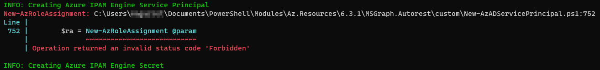

HTTP 502 responses are visible for the "spaces/vnet/multi" calls in the Developer Tools networking view.

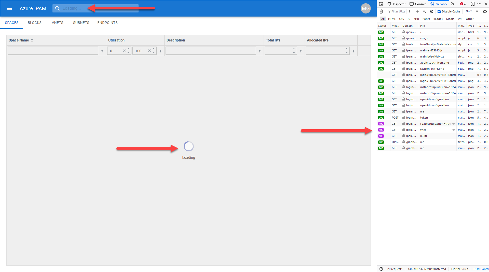

- An error in the Application Log for the App Service stating that the *Access is denied to the requested resource. The user might not have enough permission*.

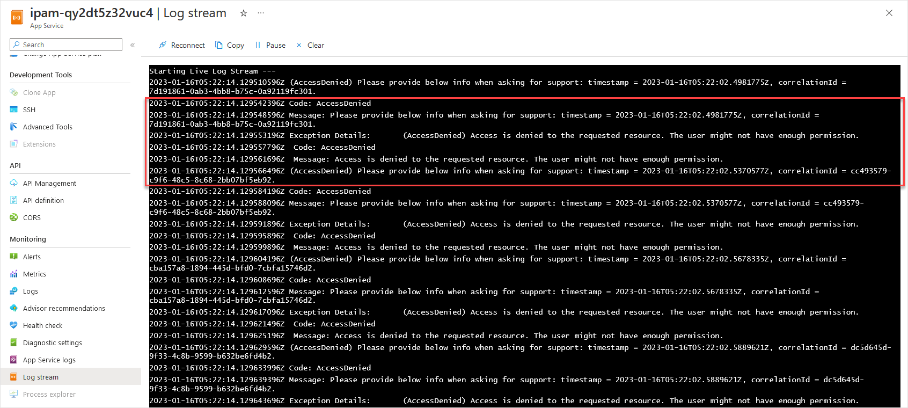

### <u>Verify</u>

You can check to see if you have the necessary permissions on the Tenant Root Group in the Azure Portal by navigating to [Management Groups](https://learn.microsoft.com/azure/governance/management-groups/overview)

If you cannot click on the *Tenant Root Group*, then you likely don't have access to the *Tenant Root Group* at all.

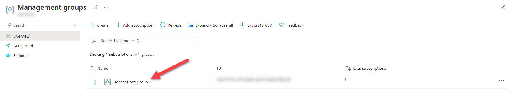

Once you select the Tenant Root Group, under *Access Control (IAM)* you can click on *View my access* to see what RBAC permissions your currently logged in user has.

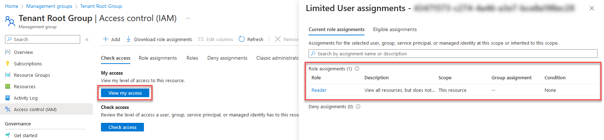

You can see from the above image, this user only has the `Reader` role, which isn't sufficient to deploy the Azure IPAM solution.

### <u>Resolve</u>

Contact your Azure Administrator (or equivalent) to request a role which has `Microsoft.Authorization/roleAssignments/write` at the *Tenant Root Group* level.

This role could be one of the following:

- [Owner](https://learn.microsoft.com/azure/role-based-access-control/built-in-roles#owner)
- [User Access Administrator](https://learn.microsoft.com/azure/role-based-access-control/built-in-roles#user-access-administrator)
- [Custom Role](https://learn.microsoft.com/azure/role-based-access-control/custom-roles) with *allow* permissions of `Microsoft.Authorization/roleAssignments/write`

### <u>Notes</u>

You can read more about the requirements for deploying Azure IPAM in the [Prerequisites](/deployment/README?id=prerequisites) section of the deployment guide.

## New-MgOauth2PermissionGrant (Failed)

### <u>Symptoms</u>

During the deployment of Azure IPAM, you see an error similar to the following:

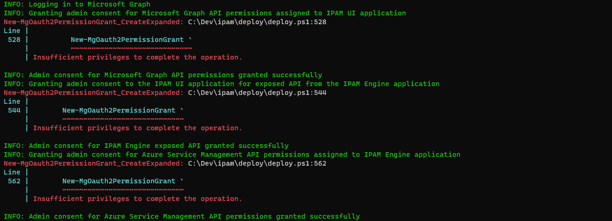

When authenticating to Azure IPAM for the first time, you are presented with a *Permissions Requested* screen.

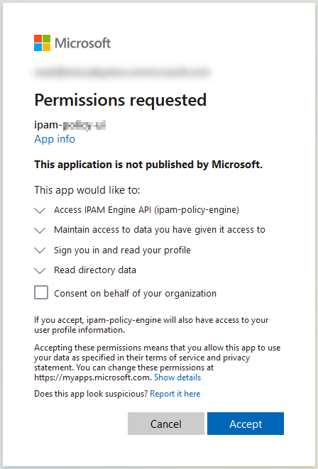

### <u>Verify</u>

The role of [Global Administrator](https://learn.microsoft.com/azure/active-directory/roles/permissions-reference#global-administrator) is required to deploy the Azure IPAM solution. This role is needed to [grant admin consent](https://learn.microsoft.com/azure/active-directory/manage-apps/grant-admin-consent?pivots=portal) for the API permissions used by the Azure IPAM [App Registrations](https://learn.microsoft.com/azure/active-directory/develop/app-objects-and-service-principals#application-registration).

Navigate to your user in Azure Active Directory and check your current [Role Assignments](https://learn.microsoft.com/azure/active-directory/fundamentals/active-directory-users-assign-role-azure-portal).

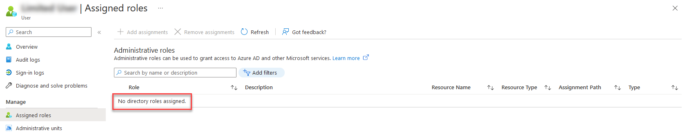

You can see from the image above that the [Global Administrator](https://learn.microsoft.com/azure/active-directory/roles/permissions-reference#global-administrator) role is not present.

### <u>Resolve</u>

Contact your Azure Active Directory Administrator (or equivalent) to request the [Global Administrator](https://learn.microsoft.com/azure/active-directory/roles/permissions-reference#global-administrator) role.

Alternatively, if your organization (like many) has separate groups whom manage Azure Active Directory permissions and Azure infrastructure, you can leverage the two-step deployment method for Azure IPAM where a member of the [Global Administrators](https://learn.microsoft.com/azure/active-directory/roles/permissions-reference#global-administrator) can deploy the required [App Registrations](https://learn.microsoft.com/azure/active-directory/develop/app-objects-and-service-principals#application-registration), then pass the generated [Parameters](https://learn.microsoft.com/azure/azure-resource-manager/templates/parameter-files) file to the Azure Infrastructure team to complete the deployment.

Here are the steps from the [Deployment](/deployment/README) section:

1. [App Registration Only Deployment](/deployment/README?id=app-registration-only-deployment)
2. [Infrastructure Stack (Only) Deployment](/deployment/README?id=infrastructure-stack-only-deployment)

### <u>Notes</u>

You can read more about the requirements for deploying Azure IPAM in the [Prerequisites](/deployment/README?id=prerequisites) section of the deployment guide.

## DisableKeyBasedMetadataWriteAccess (Cosmos DB)

### <u>Symptoms</u>

- Spaces, Blocks, Virtual Networks, Subnets, and Endpoints fail to load
- HTTP 502 responses are visible for the "me" call in the Developer Tools networking view

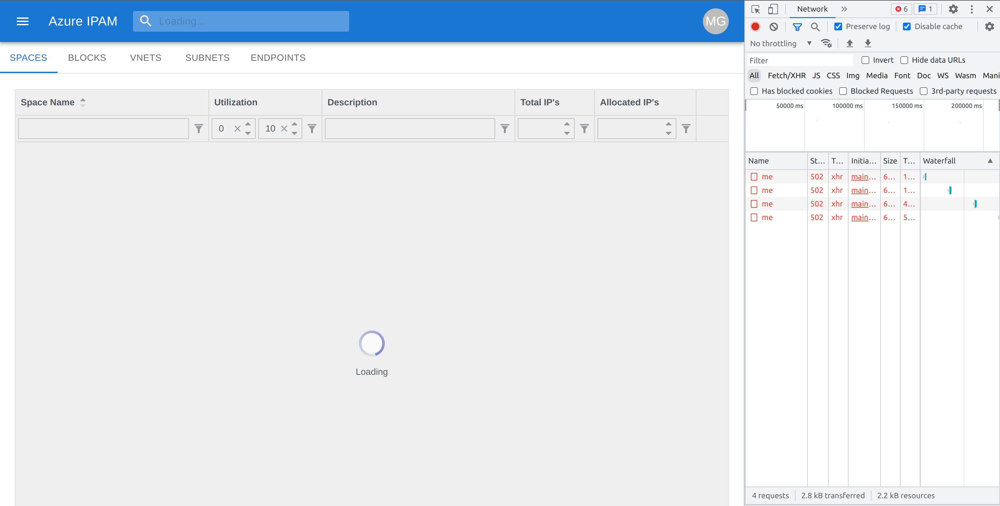

- An error in the Application Log for the App Service stating that the *Operation...is not allow through the Azure Cosmos DB endpoint*.

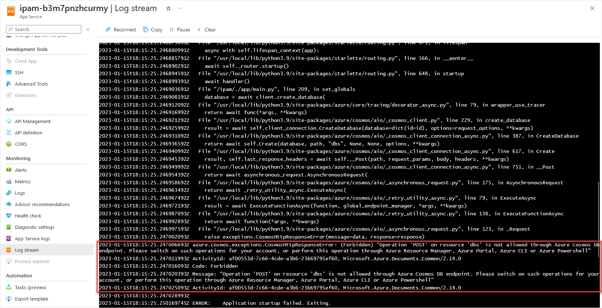

### <u>Verify</u>

You can check to see if the flag `DisableKeyBasedMetadataWriteAccess` is set on your Cosmos DB resource by running one of the following commands:

#### Azure PowerShell

```powershell
Get-AzCosmosDBAccount -ResourceGroupName <ResourceGroupName> -Name <CosmosDBAccountName>
```

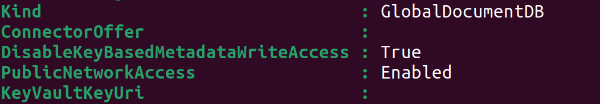

#### Azure CLI

```bash
az cosmosdb show --resource-group <ResourceGroupName> --name <CosmosDBAccountName>
```

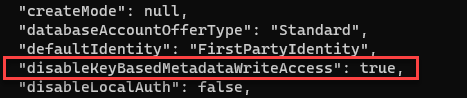

### <u>Resolve</u>

Set the `DisableKeyBasedMetadataWriteAccess` flag to `false` using one of the following commands:

#### Azure PowerShell

```powershell
Update-AzCosmosDBAccount -ResourceGroupName <ResourceGroupName> -Name <CosmosDBAccountName> -DisableKeyBasedMetadataWriteAccess $false
```

#### Azure CLI

```bash
az cosmosdb update --resource-group <ResourceGroupName> --name <CosmosDBAccountName> --disable-key-based-metadata-write-access false
```

### <u>Notes</u>

This flag may have been set by [Azure Policy](https://learn.microsoft.com/azure/governance/policy/overview). You can find more details about this policy [here](https://learn.microsoft.com/azure/cosmos-db/policy-reference#azure-cosmos-db) under *Azure Cosmos DB key based metadata write access should be disabled*. You may need to contact your policy administrator to request an exception for Azure IPAM.

Additionally this issue only applies to legacy deployments of Azure IPAM (prior to v3.0.0) as the latest versions use SQL [role-based access control](https://learn.microsoft.com/azure/cosmos-db/how-to-setup-rbac) to read/write data from Cosmos DB.
