# Troubleshooting

## New-AzRoleAssignment (Failed)

### <u>Symptoms</u>

During the deployment of Azure IPAM, you see an error similar to the following:

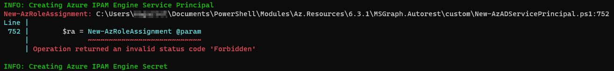

HTTP 502 responses are visible for the "spaces/vnet/multi" calls in the Developer Tools networking view.

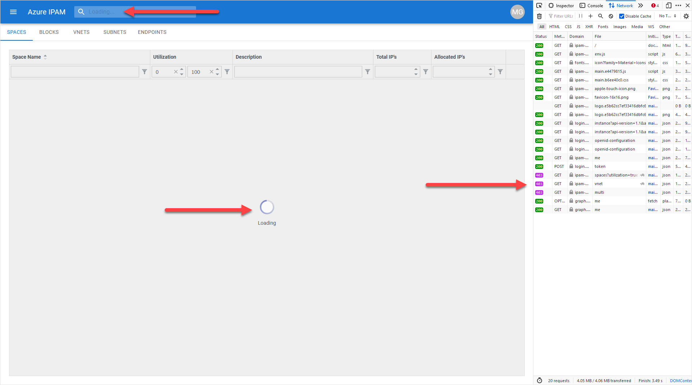

- An error in the Application Log for the App Service stating that the *Access is denied to the requested resource. The user might not have enough permission*.

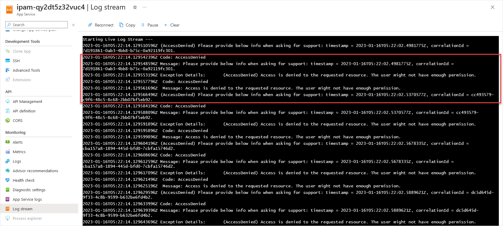

### <u>Verify</u>

You can check to see if you have the necessary permissions on the Tenant Root Group in the Azure Portal by navigating to [Management Groups](https://learn.microsoft.com/azure/governance/management-groups/overview)

If you cannot click on the *Tenant Root Group*, then you likely don't have access to the *Tenant Root Group* at all.

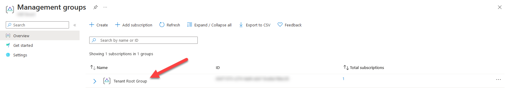

Once you select the Tenant Root Group, under *Access Control (IAM)* you can click on *View my access* to see what RBAC permissions your currently logged in user has.

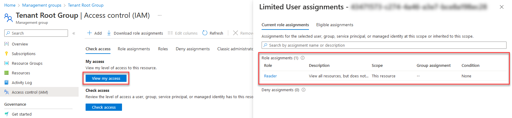

You can see from the above image, this user only has the `Reader` role, which isn't sufficient to deploy the Azure IPAM solution.

### <u>Resolve</u>

Contact your Azure Administrator (or equivalent) to request a role which has `Microsoft.Authorization/roleAssignments/write` at the *Tenant Root Group* level.

This role could be one of the following:

- [Owner](https://learn.microsoft.com/azure/role-based-access-control/built-in-roles#owner)
- [User Access Administrator](https://learn.microsoft.com/azure/role-based-access-control/built-in-roles#user-access-administrator)
- [Custom Role](https://learn.microsoft.com/azure/role-based-access-control/custom-roles) with *allow* permissions of `Microsoft.Authorization/roleAssignments/write`

### <u>Notes</u>

You can read more about the requirements for deploying Azure IPAM in the [Prerequisites](/deployment/README?id=prerequisites) section of the deployment guide.

## New-MgOauth2PermissionGrant (Failed)

### <u>Symptoms</u>

During the deployment of Azure IPAM, you see an error similar to the following:

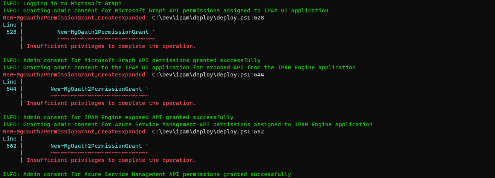

When authenticating to Azure IPAM for the first time, you are presented with a *Permissions Requested* screen.

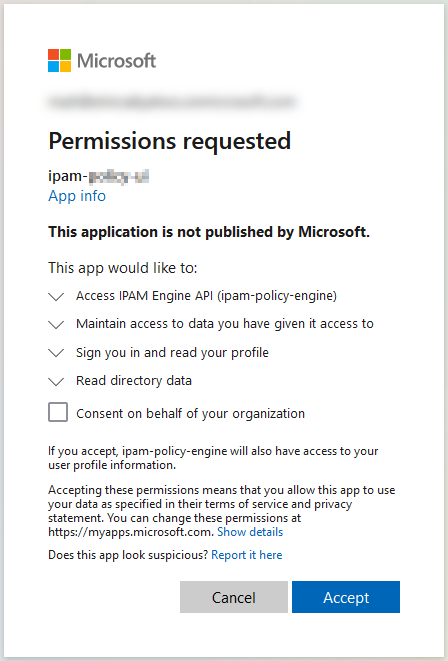

### <u>Verify</u>

The role of [Global Administrator](https://learn.microsoft.com/entra/identity/role-based-access-control/permissions-reference#global-administrator) is required to deploy the Azure IPAM solution. This role is needed to [grant admin consent](https://learn.microsoft.com/entra/identity/enterprise-apps/grant-admin-consent?pivots=portal) for the API permissions used by the Azure IPAM [App Registrations](https://learn.microsoft.com/entra/identity-platform/app-objects-and-service-principals#application-registration).

Navigate to your user in Microsoft Entra ID and check your current [Role Assignments](https://learn.microsoft.com/entra/identity/role-based-access-control/manage-roles-portal).

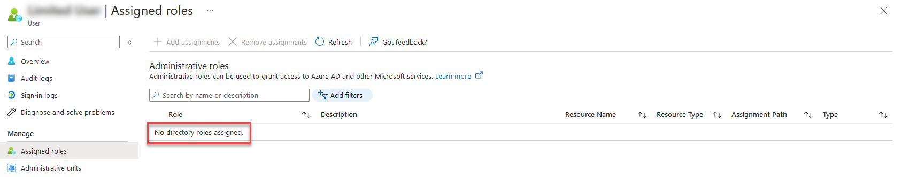

You can see from the image above that the [Global Administrator](https://learn.microsoft.com/entra/identity/role-based-access-control/permissions-reference#global-administrator) role is not present.

### <u>Resolve</u>

Contact your Microsoft Entra ID Administrator (or equivalent) to request the [Global Administrator](https://learn.microsoft.com/entra/identity/role-based-access-control/permissions-reference#global-administrator) role.

Alternatively, if your organization (like many) has separate groups who manage Microsoft Entra ID permissions and Azure infrastructure, you can leverage the two-step deployment method for Azure IPAM where a member of the [Global Administrators](https://learn.microsoft.com/entra/identity/role-based-access-control/permissions-reference#global-administrator) can deploy the required [App Registrations](https://learn.microsoft.com/entra/identity-platform/app-objects-and-service-principals#application-registration), then pass the generated [Parameters](https://learn.microsoft.com/azure/azure-resource-manager/templates/parameter-files) file to the Azure Infrastructure team to complete the deployment.

Here are the steps from the [Deployment](/deployment/README) section:

1. [App Registration Only Deployment](/deployment/README?id=app-registration-only-deployment)
2. [Infrastructure Stack (Only) Deployment](/deployment/README?id=infrastructure-stack-only-deployment)

### <u>Notes</u>

You can read more about the requirements for deploying Azure IPAM in the [Prerequisites](/deployment/README?id=prerequisites) section of the deployment guide.

## DisableKeyBasedMetadataWriteAccess (Cosmos DB)

### <u>Symptoms</u>

- Spaces, Blocks, Virtual Networks, Subnets, and Endpoints fail to load
- HTTP 502 responses are visible for the "me" call in the Developer Tools networking view

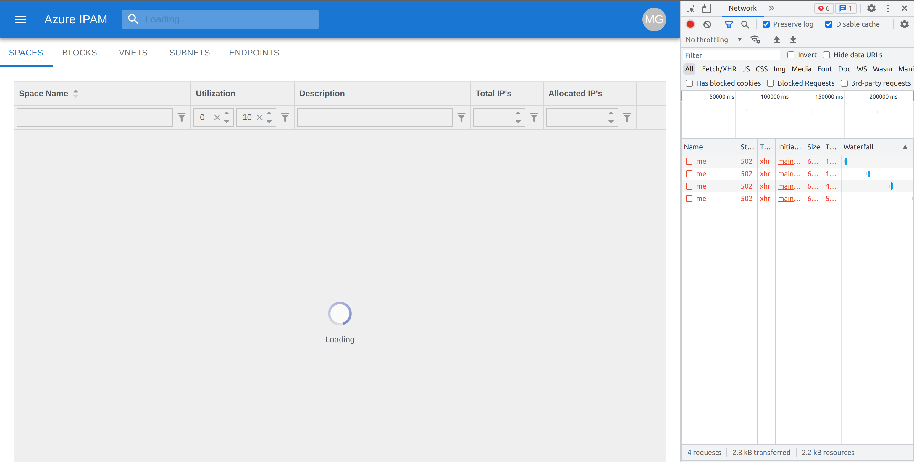

- An error in the Application Log for the App Service stating that the *Operation...is not allow through the Azure Cosmos DB endpoint*.

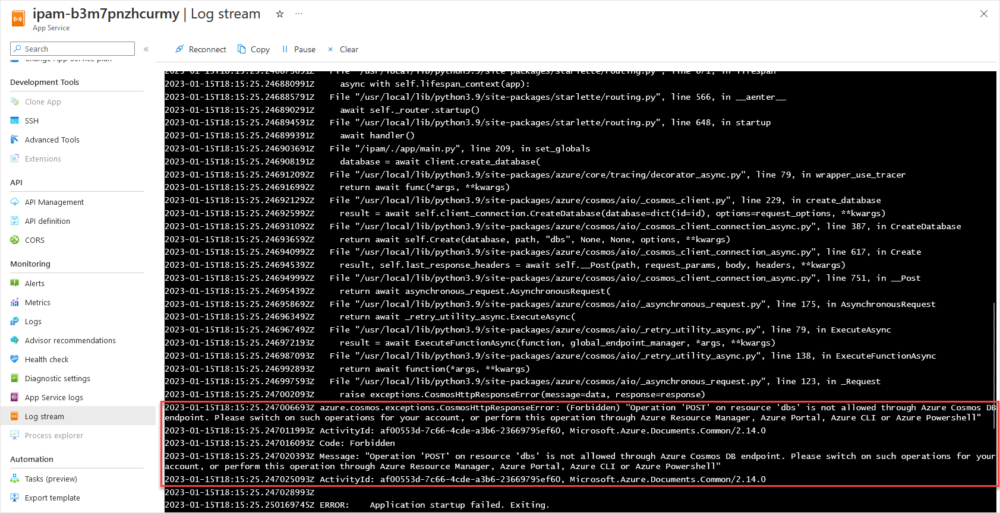

### <u>Verify</u>

You can check to see if the flag `DisableKeyBasedMetadataWriteAccess` is set on your Cosmos DB resource by running one of the following commands:

#### Azure PowerShell

```powershell
Get-AzCosmosDBAccount -ResourceGroupName <ResourceGroupName> -Name <CosmosDBAccountName>
```

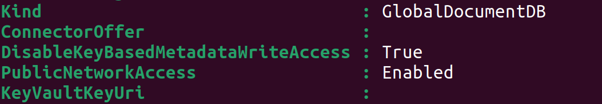

#### Azure CLI

```bash
az cosmosdb show --resource-group <ResourceGroupName> --name <CosmosDBAccountName>
```

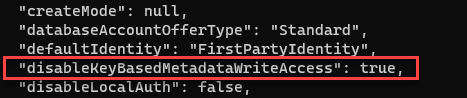

### <u>Resolve</u>

Set the `DisableKeyBasedMetadataWriteAccess` flag to `false` using one of the following commands:

#### Azure PowerShell

```powershell
Update-AzCosmosDBAccount -ResourceGroupName <ResourceGroupName> -Name <CosmosDBAccountName> -DisableKeyBasedMetadataWriteAccess $false
```

#### Azure CLI

```bash
az cosmosdb update --resource-group <ResourceGroupName> --name <CosmosDBAccountName> --disable-key-based-metadata-write-access false
```

### <u>Notes</u>

This flag may have been set by [Azure Policy](https://learn.microsoft.com/azure/governance/policy/overview). You can find more details about this policy in the [Azure Policy Built-Ins](https://learn.microsoft.com/azure/cosmos-db/policy-reference#azure-cosmos-db) documentation under *Azure Cosmos DB key based metadata write access should be disabled*. You may need to contact your policy administrator to request an exception for Azure IPAM.

Additionally this issue only applies to legacy deployments of Azure IPAM (prior to v3.0.0) as the latest versions use SQL [role-based access control](https://learn.microsoft.com/azure/cosmos-db/how-to-setup-rbac) to read/write data from Cosmos DB.

## Update Not Applied (ZIP Deploy)

### <u>Symptoms</u>

- An update completes successfully and the App Service restarts, but the application continues to run the previous version
- Fixes known to be present in the ZIP Deploy archive are missing from the running application
- Errors reported before the update continue to appear in the Application Log afterwards, unchanged
- Repeating the update produces the same result

<!-- SCREENSHOT PLACEHOLDER: Application Log showing an identical error before and after an update -->


### <u>Verify</u>

This applies to internet-restricted cloud deployments, which run the application directly from a ZIP package instead of building it on the server. The `WEBSITE_RUN_FROM_PACKAGE` app setting is set to `1`, uploaded packages are stored in `/home/data/SitePackages`, and a file named `packagename.txt` records which one is mounted as `/home/site/wwwroot`.

If `packagename.txt` is not updated during a deployment, the App Service continues to mount the package it names, no matter how many times you redeploy.

Connect to the App Service over SSH and inspect the package directory:

#### SSH

```bash
cat /home/data/SitePackages/packagename.txt
ls -la /home/data/SitePackages/
```

<!-- SCREENSHOT PLACEHOLDER: SSH session showing packagename.txt alongside the SitePackages listing -->


Packages are named for the time they were uploaded, in the form `yyyyMMddHHmmss.zip`. If the name recorded in `packagename.txt` predates your most recent deployment, that deployment did not take effect.

Archives produced by Azure IPAM v4.0.0 and later carry a manifest at their root. Where one is present, it identifies the running build directly:

```bash
cat /home/site/wwwroot/build.json
```

The `built` timestamp names the archive, which is useful in environments where deployment logs cannot be copied off the system. Archives produced before v4.0.0 do not contain this file &mdash; for those, compare the name recorded in `packagename.txt` against the time you uploaded the archive instead.

### <u>Resolve</u>

Redeploy with the Azure IPAM update script, supplying the archive explicitly:

```powershell
# Deploy a specific archive to an existing deployment
.\update.ps1 -AppName "your-ipam-app" -ResourceGroupName "your-ipam-rg" -ZipFilePath ".\ipam.zip"
```

The update script uploads through the ZIP Deploy APIs, which place the package in `/home/data/SitePackages` and update `packagename.txt`. Deployment methods that perform a server-side build write to `/home/site/wwwroot` instead, and that content is hidden beneath the read-only package mount.

Confirm that the active package advanced:

```bash
cat /home/data/SitePackages/packagename.txt
```

To return to an earlier build, redeploy that archive the same way.

### <u>Notes</u>

The five most recently deployed packages are retained as a cache. You can change this with the `SCM_MAX_ZIP_PACKAGE_COUNT` app setting. See the [Environment variables and app settings reference](https://learn.microsoft.com/azure/app-service/reference-app-settings#deployment) for details.

Running directly from a package is only used for internet-restricted clouds, where the App Service cannot reach a package index to install the Python dependencies. Deployments in all other clouds build the application on the server and are unaffected by this issue.

Microsoft does not support running from a package for Python apps on App Service, because the platform expects its build automation to create the virtual environment. Azure IPAM ships its dependencies inside the archive and adds them to `PYTHONPATH` at startup instead. As a result, `Could not find virtual environment directory /home/site/wwwroot/antenv` appears in the Application Log on every start. This is expected and is not an error.
